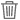

# Elementen uploaden {#add-assets}

Als u nieuwe elementen wilt toevoegen om mee te werken, uploadt u een aantal elementen van uw lokale bestandssysteem. <!-- TBD: Many of the [common file formats are supported](/help/supported-file-formats.md). -->

U kunt de volgende methoden gebruiken om een of meer elementen of een map met elementen te uploaden:

* Sleep elementen of mappen naar de gebruikersinterface en volg de aanwijzingen op het scherm.
* Klik op de optie **[!UICONTROL Add Assets]** op de werkbalk en voeg enkele bestanden toe aan het dialoogvenster voor uploaden.

<!-- TBD: Update this GIF
 -->

U kunt al deze methoden gebruiken om elementen te uploaden nadat u een map hebt gemaakt. Als u een lege map wilt maken, klikt u op **[!UICONTROL Create Folder]** op de werkbalk. Hoewel [!DNL Assets Essentials] een krachtige full-text zoekfunctionaliteit biedt, kunt u mappen ook gebruiken om uw elementen beter te ordenen.

Nadat u de bestanden hebt geselecteerd, wordt een bevestigingsvenster weergegeven waarin u meer bestanden kunt toevoegen of reeds geselecteerde bestanden kunt verwijderen. Als u meer bestanden aan een selectie wilt toevoegen, klikt u op **[!UICONTROL Browse]** en selecteert u **[!UICONTROL Browse files]** of **[!UICONTROL Browse folders]**. Voeg meer bestanden of mappen toe vanuit dezelfde map of vanuit een andere map.

Wanneer alle bestanden in de wachtrij zijn geplaatst, klikt u op **[!UICONTROL Upload]**.

*Afbeelding: Voordat u de geselecteerde elementen uploadt, kunt u elementen toevoegen aan of verwijderen uit de wachtrij.*

>[!CAUTION]
>
>Gebruik elementen zonder witruimte in de bestandsnamen. De reacties op opmerkingen werken niet voor dergelijke middelen.

## Voortgang van uploaden en status weergeven {#upload-progress}

Wanneer u veel elementen of geneste mappen uploadt naar [!DNL Assets Essentials], kunnen sommige elementen niet worden geüpload om verschillende redenen, zoals dubbele middelen en netwerkproblemen.

Als u de voortgang van het uploaden wilt bijhouden, klikt u op de optie **[!UICONTROL Upload Progress]** op de werkbalk. In een deelvenster wordt de voortgang van het uploaden van alle elementen weergegeven.

Als u een subset met elementen wilt weergeven op basis van de voortgang of status van het uploaden, gebruikt u het filter in de zijbalk **[!UICONTROL Upload Progress]**. De verschillende filters moeten alle elementen weergeven, voltooide uploads, uploads die bezig zijn, elementen in de wachtrij die moeten worden geüpload, gepauzeerde uploads, dubbele elementen en elementen die niet zijn geüpload.

*Afbeelding: Filter de elementen die u probeerde te uploaden op basis van de status van het uploaden of de voortgang van het uploaden.*

Vlak nadat de elementen zijn geüpload, verwerkt [!DNL Assets Essentials] de elementen om miniaturen te genereren en metagegevens te verwerken. Voor veel elementen duurt het enige tijd. Als er geen miniatuur wordt weergegeven en er een verwerkingsbericht wordt weergegeven bij de plaatsaanduidingsminiatuur, controleert u de map na een paar minuten opnieuw. Tijdens de verwerking worden de uitvoeringen onder andere gegenereerd door [!DNL Assets Essentials], worden slimme tags toegevoegd en worden de elementdetails geïndexeerd voor zoekopdrachten.

*Afbeelding: Geüploade elementen geven verwerking weer op het element dat wordt verwerkt.*

## Elementuitvoeringen {#renditions}

[!DNL Assets Essentials] verwerkt de geüploade elementen in bijna realtime en voor veel ondersteunde bestandstypen worden uitvoeringen gegenereerd. De uitvoeringen zijn gemaakt voor afbeeldingen en de grootte van versies van de geüploade afbeelding wordt gewijzigd. U kunt niet alleen het element downloaden, maar ook de uitvoeringen om een geschikte versie te gebruiken. U kunt alle vertoningen van activa bekijken wanneer u [voorproef activa](/help/navigate-view.md#preview-assets).

*Afbeelding: De uitvoeringen weergeven en downloaden.*

## Onderbroken uploads beheren {#resolve-upload-fails}

Als het uploaden van een ondersteund element om een of andere reden mislukt, klikt u op **[!UICONTROL Retry]** in het deelvenster [!UICONTROL Upload Progress].

*Afbeelding: Opnieuw proberen als een ondersteund bestand om een of andere reden niet kan worden geüpload.*

Als u probeert dubbele elementen te uploaden, worden de elementen pas geüpload wanneer u de upload expliciet bevestigt. Eerst worden de dubbele elementen gemarkeerd als geüploade bestanden. U lost dit probleem op door gewoon een versie te maken, de bestaande elementen te verwijderen en te vervangen of een kopie te maken door de naam van het element te wijzigen. U kunt dergelijke fouten één middel tegelijk oplossen of het bulksgewijs doen voor alle ontbroken duplicaten in één keer.

*Afbeelding: Voor dubbele elementen die standaard niet kunnen worden geüpload, lost u de kwestie één middel tegelijk op.*

*Afbeelding: Voor dubbele elementen die standaard niet kunnen worden geüpload, kunt u problemen met alle elementen tegelijk oplossen.*

>[!TIP]
>
>U kunt elementen rechtstreeks vanuit uw [!DNL Creative Cloud]-bureaubladtoepassingen uploaden naar de DAM-opslagplaats. Zie hoe [[!DNL Assets Essentials] integreert met [!DNL Adobe Asset Link]](/help/integration.md).

## Elementen of mappen verwijderen {#delete-assets}

Gebruikers kunnen afzonderlijke elementen of mappen verwijderen die niet meer vereist zijn. Voer een van de volgende handelingen uit om een middel of map te verwijderen:

* Gebruik de optie die beschikbaar is op de miniatuur van een element of map.

   

   *Afbeelding: Handelingen voor bestanden en mappen zijn beschikbaar in het element met middelen of mappen.*

* Selecteer een middel of een omslag en klik **[!UICONTROL Delete]**  in de toolbar.
