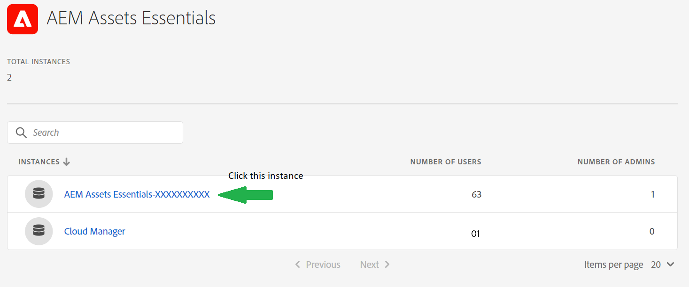
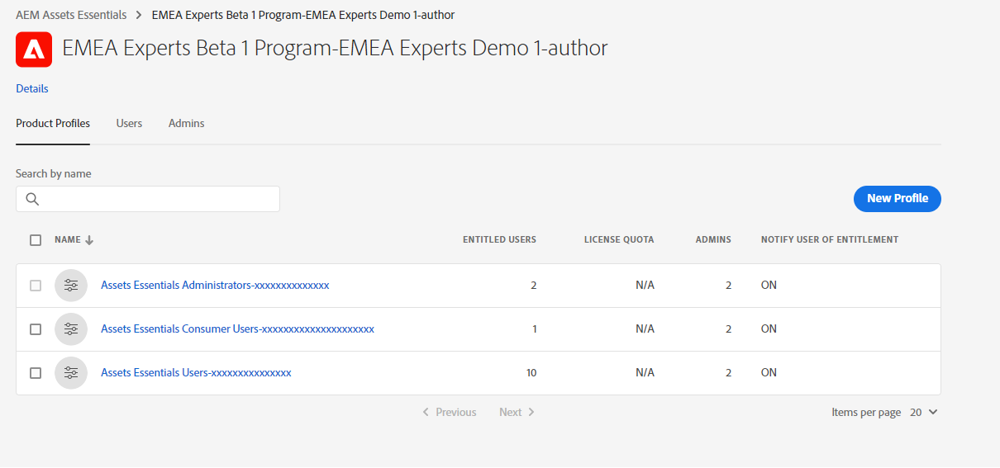

# Beheren [!DNL Assets Essentials] en gebruikers toevoegen {#administer}

[!DNL Adobe Experience Manager Assets Essentials] is provisioned door Adobe voor zijn klanten. In het kader van de levering [!DNL Assets Essentials] wordt toegevoegd aan de organisatie van een klant in [!DNL Adobe Admin Console]. Beheerders gebruiken [!DNL Admin Console] om gebruikersrechten te beheren aan [!DNL Assets Essentials] oplossing, en wijs toepassingsbeheerders aan opstellingstoestemmingen en meta-gegevensformulieren in [!DNL Assets Essentials].

Het volgende gegevensstroomdiagram illustreert de opeenvolging van taken die een beheerder moet uitvoeren om Assets Essentials te vormen en te beheren:

## Toegang tot de Admin Console {#access-admin-console}

Nadat de Assets Essentials-oplossing is ingericht, ontvangt de beheerder een e-mail van Adobe. Het e-mailbericht bevat een welkomstbericht en een koppeling om aan de slag te gaan. Daarnaast start Adobe het proces om Assets Essentials automatisch te implementeren. Het implementatieproces duurt een uur.

Via de koppeling in de e-mail kunt u toegang krijgen tot en aanmelden bij [Admin Console](https://adminconsole.adobe.com). Als u beheerdertoegang tot meer dan één organisatierekening hebt, dan selecteer de aangewezen organisatie of schakelaar aan het gebruikend [organisatieselector](https://helpx.adobe.com/nl/enterprise/using/admin-console.html). Zodra het automatische plaatsingsproces volledig is, de productkaart voor [!DNL AEM Assets Essentials] is zichtbaar in de [!DNL Admin Console].

Voer de volgende taken voor gebruikersrechten uit met behulp van Admin Console:

* [Assets Essentials-toepassingsbeheerder maken](#create-assets-essentials-administrator)

* [Gebruikersgroepen toevoegen](#add-user-groups)

* [Gebruikersgroepen toevoegen aan productprofielen](#add-users-to-product-profiles)

### Assets Essentials-toepassingsbeheerder maken {#create-assets-essentials-administrator}

Een beheerder van een Admin Console moet een Assets Essentials-toepassingsbeheerder toevoegen om taken te beheren, zoals het maken van een mapstructuur, het uploaden van elementen, het instellen van machtigingen, het instellen van metagegevensformulieren en het maken van openbare verzamelingen. Voor informatie over het toewijzen van een gebruiker of een gebruikersgroep aan een Assets Essentials-toepassingsbeheerdersprofiel raadpleegt u [gebruikers toevoegen aan productprofielen](#add-users-to-product-profiles).

### Gebruikersgroepen toevoegen {#add-user-groups}

Maak gebruikersgroepen en wijs uw gebruikers toe aan de gebruikersgroepen. Deze gebruikersgroepen zijn beschikbaar in de Assets Essentials-toepassing voor het instellen van machtigingen voor mappen.

Voor informatie over hoe te om gebruikersgroepen te beheren, zie `Create user groups` en `Edit user groups` beschikbaar op [Gebruikersgroepen beheren](https://helpx.adobe.com/enterprise/using/user-groups.html).

>[!NOTE]
>
>Als uw Admin Console is ingesteld om een extern systeem te gebruiken voor het beheer van gebruikers/groepen-toewijzingen, zoals Azure- of Google-connectors, het synchronisatieprogramma van de gebruiker of de gebruikersbeheerrusten-API, worden uw groepen en gebruikerstoewijzingen automatisch geconfigureerd. Zie voor meer informatie [Adobe Admin Console-gebruikers](https://helpx.adobe.com/enterprise/using/users.html).

Voor informatie over hoe te om het toevoegen van gebruikers aan gebruikersgroepen te beheren, zie `Add users to groups` beschikbaar op [Gebruikersgroepen beheren](https://helpx.adobe.com/in/enterprise/using/user-groups.html#add-users-to-groups).

### Gebruikersgroepen toevoegen aan productprofielen {#add-users-to-product-profiles}

Voeg gebruikersgroepen toe aan productprofielen zodat zij toegang tot de toepassing van Assets Essentials hebben.

Gebruikersgroepen toevoegen aan productprofielen:

1. Toegang [Admin Console](https://adminconsole.adobe.com) voor uw organisatie klikt u op **[!UICONTROL Products]** in de bovenste balk klikt u op **[!UICONTROL AEM Assets Essentials]** en klik vervolgens op de instantie voor [!DNL Assets Essentials]. De naam van de instantie kan anders zijn dan in de onderstaande schermafbeelding.
   >[!NOTE]
   >
   >[!DNL Cloud Manager] instance is voor speciaal admin gebruik slechts zoals het controleren van de dienststatus en het krijgen van toegang tot de dienstlogboeken en kan niet worden gebruikt om gebruikers aan het product toe te voegen.

   

   [!DNL Assets Essentials] heeft drie productprofielen die toegang voor beheerders, regelmatige, en consumenten gebruikers vertegenwoordigen.

   * **[!DNL Assets Essentials]Beheerders** administratieve toegang tot de toepassing hebben. Naast alle mogelijkheden voor eindgebruikers kunnen toepassingsbeheerders in deze groep machtigingen beheren voor elke map en groep/gebruiker in de gehele opslagplaats van de toepassing.

   * **[!DNL Assets Essentials]Gebruikers** toegang hebben tot de volledige gebruikersinterface. Deze gebruikers kunnen digitale elementen uploaden, organiseren, labelen en zoeken.

   * **[!DNL Assets Essentials]Consumentengebruikers**: toegang hebben tot de ervaring die is opgedaan met het selecteren van ingesloten elementen in [!DNL Adobe Journey Optimizer] e-mailsjablooneditor. Zie voor meer informatie [Gebruiken [!DNL Assets Essentials] in [!DNL Journey Optimizer]](https://experienceleague.adobe.com/docs/journey-optimizer/using/create-messages/assets-essentials.html).

   

1. Als u een gebruikersgroep aan het product wilt toevoegen, klikt u op een van de drie Assets Essentials-productprofielen en selecteert u **[!UICONTROL Add User]**, geef de gegevens van de gebruikersgroep op en klik op **[!UICONTROL Save]**.

   

   Wanneer u een gebruiker toevoegt, ontvangt de gebruiker een e-mailuitnodiging om aan de slag te gaan. U kunt de e-mailuitnodigingen in de instellingen voor het productprofiel uitschakelen in [!DNL Admin Console].

   >[!NOTE]
   >
   >U moet een gebruiker toevoegen aan het Assets Essentials-productprofiel voor beheerders in de Admin Console om beheertaken uit te voeren in de Assets Essentials-toepassing. Deze taken omvatten [Mappenstructuur maken](#create-folder-structure), [Rechten voor mappen beheren](#manage-permissions-for-folders), en [Metagegevens Forms instellen](#metadata-forms).

## Assets Essentials-toepassing openen {#access-assets-essentials-application}

Nadat u rechten van gebruikers hebt uitgevoerd in Admin Console, kunt u de Assets Essentials-toepassing openen om de volgende taken uit te voeren:

* [Mappenstructuur maken](#create-folder-structure)

* [Elementen uploaden](#upload-assets)

* [Rechten voor mappen beheren](#manage-permissions-for-folders)

* [Metagegevens Forms instellen](#metadata-forms)

* [Openbare verzamelingen maken](#create-public-collections)

### Mappenstructuur maken {#create-folder-structure}

U kunt de volgende methoden gebruiken om een mapstructuur te maken in de Assets Essentials-opslagplaats:

* Klik op de knop **[!UICONTROL Create Folder]** in de werkbalk kunt u een lege map maken.

* Klikken **[!UICONTROL Add Assets]** in de werkbalk beschikbaar voor [uploadt u een mapstructuur die beschikbaar is op uw lokale computer](add-delete.md).

Creeer een omslagstructuur die goed met de bedrijfsdoelstellingen voor de organisatie werkt. Als u een bestaande mapstructuur uploadt naar de Assets Essentials-opslagplaats, moet u de structuur controleren. Zie voor meer informatie [Aanbevolen procedures voor mapstructuur voor effectief machtigingsbeheer](permission-management-best-practices.md##folder-structure-assets-essentials).

Er zijn diverse mogelijke typen mapstructuur die u voor uw organisatie kunt gebruiken. Hieronder volgen enkele voorbeelden van gangbare mapstructuren:

>[!NOTE]
>
>Om deze taken te kunnen beheren, vooral het beheren van toestemmingen, moet uw gebruiker toepassingsbeheerrechten hebben - het moet aan worden toegevoegd [Assets Essentials-productprofiel voor beheerders](#add-users-to-product-profiles).

### Elementen uploaden {#upload-assets}

Als u nieuwe elementen wilt toevoegen om mee te werken, uploadt u een aantal elementen van uw lokale bestandssysteem. U kunt elementen of mappen slepen naar de gebruikersinterface en de aanwijzingen op het scherm volgen of op **[!UICONTROL Add Assets]** op de werkbalk en voegt u enkele bestanden toe aan het dialoogvenster voor uploaden. while [!DNL Assets Essentials] biedt een krachtige zoekfunctie met volledige tekst, zodat u uw elementen beter kunt ordenen met mappen. Zie voor meer informatie [Elementen uploaden](add-delete.md).

### Rechten voor mappen beheren {#manage-permissions-for-folders}

Met Assets Essentials kunnen beheerders de toegangsniveaus voor mappen in de opslagplaats beheren. Als beheerder, kunt u gebruikersgroepen tot stand brengen en toestemmingen aan die groepen toewijzen om toegangsniveaus te beheren. U kunt de bevoegdheden voor machtigingsbeheer ook delegeren aan gebruikersgroepen op mapniveau.

>[!VIDEO](https://video.tv.adobe.com/v/341104)

Zie voor meer informatie [Rechten voor mappen beheren](manage-permissions.md).

### Metagegevens Forms instellen (optioneel) {#metadata-forms}

Assets Essentials biedt standaard vele standaardmetagegevensvelden. Organisaties hebben extra behoeften aan metagegevens en hebben meer metagegevensvelden nodig om bedrijfsspecifieke metagegevens toe te voegen. Met metagegevensformulieren kunnen bedrijven aangepaste metagegevensvelden toevoegen aan het element [!UICONTROL Details] pagina. De bedrijfsspecifieke metagegevens verbeteren het beheer en de ontdekking van de bedrijfsmiddelen. U kunt geheel nieuwe formulieren maken of een bestaand formulier opnieuw gebruiken.

U kunt metagegevensformulieren configureren voor verschillende typen elementen (verschillende MIME-typen). Gebruik dezelfde formuliernaam als het MIME-type van het bestand. Essentiële elementen komen automatisch overeen met het MIME-type voor geüploade elementen met de naam van het formulier en werken de metagegevens voor de geüploade elementen bij op basis van de formuliervelden.

Als een metagegevensformulier bijvoorbeeld op naam staat `PDF` of `pdf` bestaat, bevatten de geüploade PDF-documenten metagegevensvelden zoals gedefinieerd in het formulier.

Zie voor meer informatie [Metagegevensformulieren](metadata.md#metadata-forms).

>[!VIDEO](https://video.tv.adobe.com/v/341275)

Ga voor meer informatie over Metadata Forms naar [Metagegevens Forms in Assets Essentials](metadata.md#metadata-forms).

### Openbare verzamelingen maken (optioneel) {#create-public-collections}

Een verzameling is een set elementen binnen Experience Manager Assets Essentials. Gebruik verzamelingen om elementen tussen gebruikers te delen.

In tegenstelling tot mappen kan een verzameling elementen van verschillende locaties bevatten. U kunt meerdere verzamelingen delen met een gebruiker. Elke verzameling bevat verwijzingen naar elementen. De referentiële integriteit van activa wordt gehandhaafd over inzamelingen. Zie voor meer informatie [Verzamelingen beheren](manage-collections.md).

## Volgende stappen {#next-steps}

* [Bekijk een video om Assets Essentials te implementeren](https://experienceleague.adobe.com/docs/experience-manager-learn/assets-essentials/provisioning.html?lang=en)

* Feedback geven op het product met de [!UICONTROL Feedback] -optie beschikbaar in de gebruikersinterface van Assets Essentials

* Documentfeedback geven met [!UICONTROL Edit this page]  of [!UICONTROL Log an issue]  beschikbaar op de rechterzijbalk

* Contact [Klantenservice](https://experienceleague.adobe.com/?support-solution=General#support)

>[!MORELIKETHIS]
>
>* [[!DNL Admin Console] help](https://helpx.adobe.com/enterprise/using/admin-console.html)
>* [[!DNL Cloud Manager] help](https://experienceleague.adobe.com/docs/experience-manager-cloud-manager/using/introduction-to-cloud-manager.html)
>* [Adobe Journey Optimizer-documentatie](https://experienceleague.adobe.com/docs/journey-optimizer/using/ajo-home.html)
>* [Opmerkingen bij de release](release-notes.md)
>* [Aan de slag met [!DNL Assets Essentials]](get-started.md)

