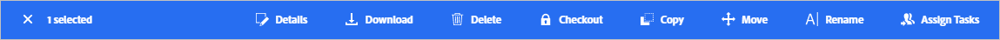

# Elementen beheren {#manage-assets}

U kunt verschillende DAM-taken (Digital Asset Management) eenvoudig uitvoeren met de gebruikersvriendelijke interface van [!DNL Assets Essentials]. Nadat u de elementen hebt toegevoegd, kunt u uw elementen zoeken, downloaden, verplaatsen, kopiëren, hernoemen, verwijderen, bijwerken en bewerken.

Gebruik [!DNL Assets Essentials] om de volgende taken voor middelenbeheer uit te voeren. Wanneer u een element selecteert, worden de volgende opties bovenaan op de werkbalk weergegeven.

*Afbeelding: De werkbalk bevat opties voor een geselecteerde afbeelding.*

*  pictogram uitSelectie van selectie opheffen.
*  Als u een voorvertoning weergeeft, kunt u de versies weergeven en een afbeelding bewerken.
*  pictogramDownload het geselecteerde element naar uw lokale bestandssysteem.
*  verwijderenHiermee verwijdert u het geselecteerde middel of de geselecteerde map.
* 

   <!--  --> Checkout an asset.
*  pictogramKopieer het geselecteerde bestand of de geselecteerde map.
*  pictogramVerplaats het geselecteerde element of de geselecteerde map naar een andere locatie in de hiërarchie van de opslagplaats.
*  pictogram wijzigenNaam van geselecteerd element of geselecteerde map wijzigen. Gebruik een unieke naam anders ontbreekt het anders noemen met een waarschuwing. U kunt het opnieuw proberen met een nieuwe naam.
* 
   <!--  --> Assign tasks to other users to collaborate on an asset.

U kunt dezelfde opties weergeven op de miniaturen van elementen.

[!DNL Assets Essentials] Hiermee geeft u op de werkbalk alleen de relevante opties weer die afhankelijk zijn van het type geselecteerd element.

*Afbeelding: De werkbalk bevat opties voor een geselecteerde map.*

*Afbeelding: De werkbalk bevat opties voor een geselecteerd PDF-bestand.*

## Elementen downloaden en distribueren {#download}

U kunt een of meer elementen of mappen of een combinatie van beide selecteren en de selectie naar uw lokale bestandssysteem downloaden. U kunt de elementen bewerken en opnieuw uploaden of de elementen buiten [!DNL Assets Essentials] verspreiden. U kunt ook [de uitvoeringen](/help/add-delete.md#renditions) van een element downloaden.

## Versiering van bedrijfsmiddelen {#versions-of-assets}

<!-- 
TBD: query for engineering: How many versions are maintained. What happens when we reach that limit? Are old versions automatically removed? -->

[!DNL Assets Essentials] Hiermee worden de elementen bijgewerkt of bewerkt wanneer de elementen opnieuw worden geüpload. U kunt versiegeschiedenis, oudere versies bekijken, en een vroegere versie van activa als recentste versie herstellen, die aan een vorige versie indien nodig wordt teruggezet. In de volgende scenario&#39;s worden versies van middelen gemaakt:

* Upload een nieuw element met dezelfde bestandsnaam als een bestaand element en in dezelfde map als het bestaande element. [!DNL Assets Essentials] vragen om het vorige element te overschrijven of het nieuwe element op te slaan als een versie. Zie [dubbele elementen uploaden](/help/add-delete.md#resolve-upload-fails).

   

   *Afbeelding: Wanneer u een element uploadt dat hetzelfde heet als een bestaand element, kunt u een versie van het element maken.*

* Bewerk een afbeelding en klik op **[!UICONTROL Save as Version]**. Zie [Afbeeldingen bewerken](/help/edit-images.md).

   

   *Afbeelding: Bewerkte afbeelding opslaan als versie.*

* Open de versies van een bestaand element. Klik op **[!UICONTROL New Version]** en upload een nieuwere versie van het middel in de repository.

   

### Versies van een element {#view-versions} weergeven

Wanneer u een gedupliceerde kopie of een gewijzigde kopie van een element uploadt, kunt u de versies ervan maken. Met Versioning kunt u historische elementen controleren en desgewenst terugkeren naar een vorige versie.

Als u versies wilt weergeven, opent u de voorvertoning van een element en klikt u in de rechterzijbalk op **[!UICONTROL Versions]** . Als u een voorvertoning van een specifieke versie wilt weergeven, selecteert u deze. Klik op **[!UICONTROL Make Latest]** om het item te herstellen.

U kunt ook versies maken van de tijdlijn van de versie. Selecteer de meest recente versie, klik op **[!UICONTROL New Version]** en upload een nieuwe kopie van het element vanuit uw lokale bestandssysteem.

*Afbeelding: U kunt versies van een element weergeven, terugkeren naar een vorige versie of een andere nieuwe versie uploaden.*
