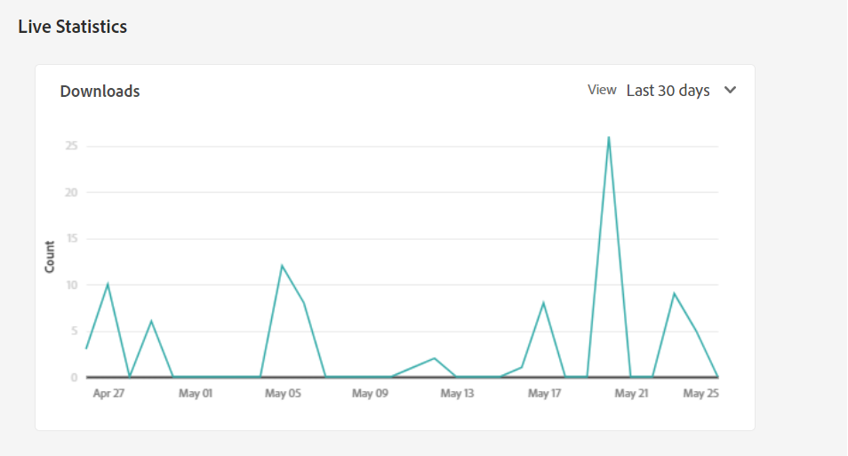

# Rapporten beheren {#manage-reports}

Met Asset Reporting kunnen beheerders het nut van Adobe Experience Manager Assets Essentials-implementatie beoordelen. De rapporten verstrekken nuttige informatie over hoe de gebruikers met activa in uw plaatsing in wisselwerking staan.

Gebruik de informatie in de rapporten om zeer belangrijke succesmetriek af te leiden om de goedkeuring van Activa binnen uw onderneming en door klanten te meten.

## Toegangsrapporten {#access-reports}

Alle gebruikers die zijn toegewezen aan de [Productprofiel Assets Essentials-beheerders](deploy-administer.md) heeft toegang tot live statistieken en rapporten in Assets Essentials.

## Live statistieken weergeven {#view-live-statistics}

Met Assets Essentials kunt u automatisch gegenereerde downloadgegevens voor uw Assets Essentials-implementatie weergeven. U kunt selecteren om het aantal downloads van activa te bekijken die tijdens de afgelopen 30 dagen of voor de laatste 12 maanden worden uitgevoerd.

Navigeren naar **[!UICONTROL Settings]** > **[!UICONTROL Live Statistics]** om de automatisch gegenereerde downloadgegevens weer te geven.

## Een rapport maken {#create-report}

Een rapport maken:

1. Navigeren naar **[!UICONTROL Settings]** > **[!UICONTROL Reports]** en klik op **[!UICONTROL Create Report]**.

1. In de [!UICONTROL Configuration] , geeft u een titel en een optionele beschrijving voor het rapport op.

1. Selecteer het mappad, waarin de elementen staan waarmee het rapport moet worden uitgevoerd. Gebruik hiervoor de optie **[!UICONTROL Select Folder Path]** veld.

1. Selecteer het datuminterval voor het rapport.

1. In de [!UICONTROL Columns] selecteert u de kolomnamen die u in het rapport wilt weergeven.

1. Klik op **[!UICONTROL Create]**.

   

De volgende lijst verklaart het gebruik van alle kolommen die u aan het rapport kunt toevoegen:

<table>
    <tbody>
     <tr>
      <th><strong>Kolomnaam</strong></th>
      <th><strong>Beschrijving</strong></th>
     </tr>
     <tr>
      <td>Titel</td>
      <td>De titel van het element.</td>
     </tr>
     <tr>
      <td>Pad</td>
      <td>Het mappad waar het element beschikbaar is in Assets Essentials.</td>
     </tr>
     <tr>
      <td>Type</td>
      <td>Het MIME-type voor het element.</td>
     </tr>
     <tr>
      <td>Grootte</td>
      <td>De grootte van het element.</td>
     </tr>
     <tr>
      <td>Gedownload door</td>
      <td>De e-mailid van de gebruiker die het element heeft gedownload.</td>
     </tr>
     <tr>
      <td>Downloaddatum</td>
      <td>De datum waarop de handeling voor het downloaden van middelen wordt uitgevoerd.</td>
     </tr>
     <tr>
      <td>Auteur</td>
      <td>De auteur voor het element.</td>
     </tr>
     <tr>
      <td>Aanmaakdatum</td>
      <td>De datum waarop het element naar Assets Essentials is geüpload.</td>
     </tr>
     <tr>
      <td>Wijzigingsdatum</td>
      <td>De datum waarop het element voor het laatst is gewijzigd.</td>
     </tr>
     <tr>
      <td>Verlopen</td>
      <td>De vervalstatus van het actief.</td>
     </tr>
     <tr>
      <td>Gedownload op gebruikersnaam</td>
      <td>De naam van de gebruiker die het element heeft gedownload.</td>
     </tr>           
    </tbody>
   </table>

## De lijst met rapporten weergeven {#view-report-list}

Na [opstellen van het rapport](#create-report)kunt u de lijst met rapporten weergeven en deze downloaden in CSV-indeling of verwijderen.

Als u de lijst met rapporten wilt weergeven, navigeert u naar **[!UICONTROL Settings]** > **[!UICONTROL Reports]**.

Voor elk rapport, kunt u rapporttitel, het type van het rapport, gespecificeerde beschrijving bekijken terwijl het creëren van het rapport, status van het rapport, e-mailidentiteitskaart van de auteur die het rapport creeerde, en de datum van de rapportverwezenlijking.

`Completed ` de status van het rapport geeft aan dat het rapport klaar is om te worden gedownload .

## Een CSV-rapport downloaden {#download-csv-report}

Een rapport in CSV-indeling downloaden:

1. Ga naar **[!UICONTROL Settings]** > **[!UICONTROL Reports]**.

1. Selecteer een rapport en klik op **[!UICONTROL Download CSV]**.

Het geselecteerde rapport wordt gedownload in CSV-indeling. De kolommen die in het CSV-rapport worden weergegeven, zijn afhankelijk van de kolommen die u selecteert terwijl [opstellen van het rapport](#create-report).

## Een rapport verwijderen {#delete-report}

Een rapport verwijderen:

1. Ga naar **[!UICONTROL Settings]** > **[!UICONTROL Reports]**.

1. Selecteer een rapport en klik op **[!UICONTROL Delete]**.
