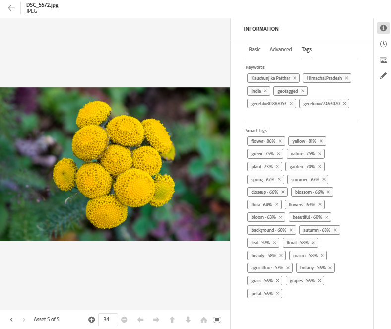
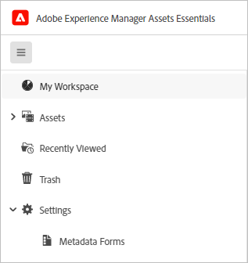

# Metagegevens in [!DNL Assets Essentials] {#metadata}

Metagegevens zijn gegevens of een beschrijving van de gegevens. Uw afbeeldingen als een element kunnen bijvoorbeeld informatie bevatten over de camera waarop u hebt geklikt of over copyrightgegevens. Deze informatie is metagegevens van de afbeelding. Metagegevens zijn essentieel voor efficiënt middelenbeheer. Metagegevens zijn de verzameling van alle gegevens die voor een element beschikbaar zijn, maar hoeven niet noodzakelijkerwijs in dat element te zijn opgenomen.

Met metagegevens kunt u elementen verder indelen. Dit is handig wanneer de hoeveelheid digitale informatie toeneemt. Het is mogelijk om een paar honderd bestanden te beheren op basis van alleen de bestandsnamen, miniaturen en het geheugen. Deze aanpak is echter niet schaalbaar. Het is te kort wanneer het aantal betrokken personen en het aantal beheerde activa toenemen.

Als er metagegevens worden toegevoegd, neemt de waarde van een digitaal element toe, omdat het element

* Toegankelijker - systemen en gebruikers kunnen het gemakkelijk vinden.
* Gemakkelijker te beheren - u kunt gemakkelijker middelen met de zelfde reeks eigenschappen vinden en veranderingen op hen toepassen.
* Volledig - asset bevat meer informatie en context met meer metagegevens.

Om deze redenen beschikt u over de juiste middelen om metagegevens voor uw digitale elementen te maken, te beheren en uit te wisselen.

## De metagegevens weergeven {#view-metadata}

Als u de metagegevens van een element wilt weergeven, bladert u naar het element of doorzoekt u het element, selecteert u het element en klikt u op **[!UICONTROL Details]** op de werkbalk.

*Afbeelding: Als u een element en de bijbehorende metagegevens wilt weergeven, klikt u **[!UICONTROL Details]**op de werkbalk of dubbelklikt u op het element.*

De basismetagegevens, zoals titel, beschrijving en uploaddatum, zijn beschikbaar op het tabblad [!UICONTROL Basic]. Het tabblad [!UICONTROL Advanced] bevat meer geavanceerde metagegevens, zoals cameramodel, lensdetails en geotags. Het tabblad [!UICONTROL Tags] bevat automatisch toegepaste tags op basis van de inhoud van de afbeelding.

## Metagegevens bijwerken {#update-metadata}

U kunt een aantal metagegevensvelden handmatig bijwerken. De velden omvatten [!UICONTROL Title], [!UICONTROL Description], [!UICONTROL Author], en [!UICONTROL Keywords].

## Tags {#tags}

[!DNL Assets Essentials] gebruikt artificiële intelligentie die door  [Adobe ](https://www.adobe.com/sensei.html) Senseito wordt verstrekt automatisch relevante markeringen op al uw geupload activa toepassen. Deze labels, met de juiste naam Slimme tags, verhogen de snelheid van de inhoud van uw projecten door u te helpen snel relevante elementen te vinden. De slimme tags zijn een voorbeeld van metagegevens die niet in de afbeelding voorkomen.

De slimme tags worden toegepast in de buurt van realtime en worden gegenereerd op basis van de inhoud van de afbeelding. Wanneer u een element uploadt, wordt in de gebruikersinterface [!UICONTROL Processing] gedurende enige tijd weergegeven op de elementminiatuur. Als de verwerking is voltooid, kunt u [de metagegevens](#view-metadata) en de slimme tags weergeven.

*Afbeelding: Als u de slimme tags van een element wilt weergeven, klikt u **[!UICONTROL Details]**op de werkbalk of dubbelklikt u op het element.*

Slimme tags bevatten ook een betrouwbaarheidsscore als percentage. Het geeft het vertrouwen aan dat aan de toegepaste tag is gekoppeld. U kunt de automatisch toegepaste slimme tags verkleinen.

## Tags toevoegen of bijwerken {#manually-tag}

U kunt meer tags toevoegen aan uw elementen, naast de slimme tags die automatisch worden toegevoegd met de slimme service [!DNL Adobe Sensei]. Open een element voor voorvertoning, klik op [!UICONTROL Tags] en typ de gewenste trefwoorden in het veld [!UICONTROL Keywords]. Druk op Return om de tag toe te voegen. [!DNL Assets Essentials] indexeert het sleutelwoord in dichtbij echt - tijd en uw team kan spoedig de bijgewerkte activa zoeken gebruikend de nieuwe sleutelwoorden.

U kunt ook codes uit de sectie [!UICONTROL Smart Tags] verwijderen die automatisch door [!DNL Assets Essentials] aan alle geüploade elementen worden toegevoegd.

## Metagegevensformulieren {#metadata-forms}

Assets Essentials biedt standaard vele standaardmetagegevensvelden. Organisaties hebben extra behoeften aan metagegevens en hebben meer metagegevensvelden nodig om bedrijfsspecifieke metagegevens toe te voegen. Met metagegevensformulieren kunnen bedrijven aangepaste metagegevensvelden toevoegen aan de pagina [!UICONTROL Details] van een element. De bedrijfsspecifieke metagegevens verbeteren het beheer en de ontdekking van de bedrijfsmiddelen.

U kunt metagegevensformulieren configureren voor verschillende typen elementen (verschillende MIME-typen). Gebruik dezelfde formuliernaam als het MIME-type van het bestand. Essentiële elementen komen automatisch geüploade elementen overeen met de naam van het formulier. Als bijvoorbeeld een metagegevensformulier met de naam `PDF` of `pdf` bestaat, bevatten de geüploade PDF-documenten metagegevensvelden zoals gedefinieerd in het formulier. U kunt geheel nieuwe formulieren maken of een bestaand formulier opnieuw gebruiken.

>[!IMPORTANT]
>
>Het nieuwe metagegevensformulier voor een specifiek bestandstype vervangt volledig het standaardmetagegevensformulier dat [!DNL Assets Essentials] biedt. Als u een metagegevensformulier verwijdert of de naam ervan wijzigt, zijn de standaardmetagegevensvelden weer beschikbaar voor nieuwe elementen.

Ga als volgt te werk om een metagegevensformulier te maken:

1. Klik in de linkertrack op **[!UICONTROL Settings]** > **[!UICONTROL Metadata Forms]**.

   

1. Klik **[!UICONTROL Create]**, in het hoger-juiste gebied van het gebruikersinterface.
1. Geef een naam op voor het formulier en klik op **[!UICONTROL Create]**.
1. Geef een naam op voor de tab in **[!UICONTROL Settings]** in de rechtertrack.
1. Sleep de vereiste componenten op een tabblad in het formulier vanaf de **[!UICONTROL Components]** die beschikbaar zijn in de linkertrack. Sleep de componenten in de gewenste volgorde.

   

   *Afbeelding: Metagegevens maken interface met opties voor het toevoegen van componenten en optie voor het weergeven van een voorbeeld van het formulier.*

1. Geef voor elke component in de code een naam op in de **[!UICONTROL Settings]** in de rechtertrack en geef deze een afbeelding met de ondersteunde eigenschappen op.
1. Selecteer voor een component desgewenst **[!UICONTROL Required]** om het metagegevensveld verplicht te maken en selecteer **[!UICONTROL Read-Only]** om het veld onbewerkbaar te maken op de elementpagina [!UICONTROL Details].
1. Klik desgewenst op **[!UICONTROL Preview]** om een voorbeeld te bekijken van het formulier dat u maakt.
1. Voeg desgewenst meer tabbladen en de vereiste componenten toe aan elk tabblad.
1. Klik **[!UICONTROL Save]** wanneer het formulier volledig is.

Nadat een formulier is gemaakt, wordt het automatisch toegepast wanneer gebruikers een element van het overeenkomende MIME-type uploaden.

Als u een bestaand formulier opnieuw wilt gebruiken om een nieuw formulier te maken, selecteert u een metagegevensformulier, klikt u op **[!UICONTROL Copy]** op de werkbalk, geeft u een naam op en klikt u op **[!UICONTROL Confirm]**. U kunt een metagegevensformulier bewerken om het te wijzigen. Wanneer u een formulier wijzigt, wordt dit gebruikt voor elementen die na de wijziging worden geüpload. De bestaande activa blijven ongewijzigd.

<!-- TBD: Cannot create a form using the second option. Documenting only the first option for now.
To reuse an existing form to create a new form, do one of these:

* Select a metadata form and click **[!UICONTROL Copy]** from the toolbar, provide a name, and click **[!UICONTROL Confirm]**.

* Click **[!UICONTROL Create]**, select **[!UICONTROL Use existing form structure as template]** option, and select an existing form. 
-->

<!-- TBD: Queries for PM and engg.

Can we edit the existing metadata in any form?

How to moderate smart tags?

Allow or deny list for smart tags?

What about Tags displayed just above Smart Tags in the UI?

Is there a detailed metadata tab. Where do the other details of an asset go?

How can one search based strictly on the metadata. Similar to AEM Assets GQL queries.
-->

<!-- TBD: Link to related articles if any.

>[!MORELIKETHIS]
>
>* [Search assets](search.md).
-->
