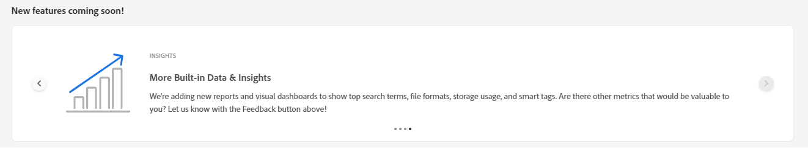

# Mijn werkruimte voor middelen {#my-workspace}

Middelen beschikken nu over een aanpasbare werkruimte die widgets biedt voor eenvoudige toegang tot belangrijke gebieden van de gebruikersinterface van Elementen en informatie die voor u het meest relevant is. Deze pagina dient als een one-stop oplossing om een overzicht van uw het werkpunten te verstrekken en snelle toegang tot zeer belangrijke werkschema&#39;s te geven. Een handiger toegang tot deze opties verhoogt de efficiëntie en snelheid van de inhoud.

U hebt toegang tot mijn werkruimte door op **[!UICONTROL My Workspace]** uit de items in het linkernavigatievenster. Mijn werkruimte bevat diverse widgets met de volgende nieuwe functies, inzichten, taken en inhoudwidgets. U kunt configureren hoe deze widgets in uw werkruimte worden weergegeven op basis van uw voorkeuren.

>[!NOTE]
>
>Widget Inhoudingen is alleen zichtbaar voor beheerders.

**Nieuwe functies binnenkort beschikbaar**

Hiermee worden aanstaande functies voor elementen gemarkeerd.

**Inzichten**

Beheerders kunnen een overzicht weergeven van het aantal downloads en uploads dat de afgelopen 30 dagen in de omgeving van middelen is uitgevoerd. U kunt op **[!UICONTROL View all]** om snel naar de pagina Inzichten voor gedetailleerdere dashboards te navigeren.

**Taken**

Toont de lijst van taken momenteel aan u in worden toegewezen **[!UICONTROL My Tasks]** door u gemaakt in het dialoogvenster **[!UICONTROL Assigned tasks]** en de taken die u al in het dialoogvenster **[!UICONTROL Completed]** tab. U kunt een taak selecteren en op **[!UICONTROL Complete Task]** om een taak goed te keuren of af te wijzen. U kunt ook een taak selecteren en op **[!UICONTROL Open Task Details]** om de taak weer te geven en deze goed te keuren, af te wijzen, te bewerken of te verwijderen.

>[!NOTE]
>
> De **[!UICONTROL Assign Tasks]** als u een taak op een element aan een andere gebruiker wilt toewijzen, is deze beschikbaar wanneer u een element selecteert of wanneer u de weergave met de elementgegevens opent.

**Inhoud**

Hiermee geeft u een overzicht weer van de elementen, inclusief de lijst met elementen die u onlangs hebt bekeken. U kunt ervoor kiezen om elementen in de widget weer te geven in een Lijstweergave, Rasterweergave, Galerijweergave of Watervalweergave en de elementen te sorteren op naam, grootte en gewijzigde datum. U kunt ook een element selecteren om de elementdetails weer te geven of het uit de lijst met onlangs weergegeven elementen te verwijderen.

## Mijn werkruimte aanpassen {#configure-widgets}

Alle widgets worden standaard weergegeven, maar u kunt de widgets die in Mijn werkruimte worden weergegeven, in- of uitschakelen. De voorkeuren zijn specifiek voor elke gebruiker.

1. Klikken **[!UICONTROL My Workspace]** beschikbaar in het linkernavigatievenster en klik op **[!UICONTROL Customize]**.

1. Schakel de schakeloptie uit voor de widget die u niet hoeft weer te geven in de werkruimte. U kunt een widget ook naar een geschikte locatie slepen om de weergavevolgorde in de werkruimte bij te werken.

1. Klikken **[!UICONTROL Done]** om de wijzigingen op te slaan.

   
