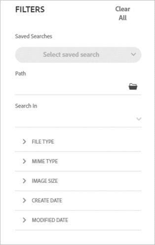

# Middelen zoeken in [!DNL Assets Essentials] {#search-assets}

[!DNL Assets Essentials] biedt effectief zoeken, dat werkt standaard. De zoekopdracht is uitgebreid omdat er in volledige tekst wordt gezocht. Met de krachtige zoekfunctionaliteit kunt u snel de juiste middelen vinden en de snelheid van de inhoud verbeteren. [!DNL Assets Essentials] biedt zoekopdrachten in volledige tekst en zoekopdrachten via metagegevens, zoals slimme tags, titel, gemaakte datum en copyright.

Als u elementen wilt zoeken,

* Klik in het zoekvak boven aan de pagina. Standaard wordt gezocht in de map waarin u momenteel bladert. Voer een van de volgende handelingen uit:

   

   * Zoeken met een trefwoord en desgewenst map wijzigen. Druk op Return.

   * Begin met werken met een onlangs weergegeven element door er direct naar te zoeken. Klik in het zoekvak en selecteer een element dat onlangs is weergegeven in de suggesties.

## De zoekresultaten filteren {#refine-search-results}

U kunt de zoekresultaten filteren op basis van de volgende parameters.

*Afbeelding: Gezochte elementen filteren op basis van verschillende parameters.*

* Bestandstype: Filter de zoekresultaten op de ondersteunde bestandstypen: `Images`, `Documents` en `Videos`.
* MIME-type: Filter voor een of meer ondersteunde bestandsindelingen. <!-- TBD:  [supported file formats](/help/supported-file-formats.md). -->
* Afbeeldingsgrootte: Geef een van de minimale en maximale afmetingen op voor het filteren van afbeeldingen. De grootte wordt opgegeven in pixelafmetingen en is niet de bestandsgrootte van de afbeeldingen.
* Aanmaakdatum: De aanmaakdatum van het element, zoals vermeld in de metagegevens. De standaarddatumnotatie die wordt gebruikt, is `yyyy-mm-dd`.
* Datum gewijzigd: De laatste gewijzigde datum van de elementen. De standaarddatumnotatie die wordt gebruikt, is `yyyy-mm-dd`.

U kunt de gezochte elementen in stijgende of dalende orde van `Name`, `Relevancy`, `Size`, `Modified`, en `Created` sorteren.

## Opgeslagen zoekopdrachten {#saved-search}

Zoekfuncties zijn eenvoudig te gebruiken in [!DNL Assets Essentials]. Vanuit het zoekvak kunt u niet alleen een trefwoord typen en op Enter drukken om de resultaten weer te geven, maar u kunt ook snel met één klik nogmaals zoeken naar de laatst doorzochte trefwoorden.

U kunt de zoekresultaten ook filteren op basis van specifieke criteria voor metagegevens en het type element. Voor veelgebruikte filters kunt u de zoekervaring verbeteren door [!DNL Assets Essentials] de zoekparameters op te slaan. Vervolgens kunt u de opgeslagen zoekopdracht selecteren en het filter toepassen met één klik.

Als u een opgeslagen zoekopdracht wilt maken, zoekt u naar een element, past u een of meer filters toe en klikt u op [!UICONTROL Save Search] in het deelvenster [!UICONTROL Filters].

<!-- TBD: Search behavior. Full-text search. Ranking and rank boosts. Hidden assets.
Report poor UX that users can only save a filtered search and not a simple search.
.
Are other supported files fully indexed and support full-text search? Eg. audio/videos files can at best have metadata indexed.
Anything about ranking of assets displayed in search results?

What about temporarily hiding an asset (suspending search on it) from the search results? If an asset is undergoing review collaboration, should it be used by others? Should it be hidden in search?

When userA is searching and userB add an asset that matches search results, will the asset display in search as soon as userA refreshes the page? Assuming indexing is near real-time. May not be so for bulk uploads.
-->
