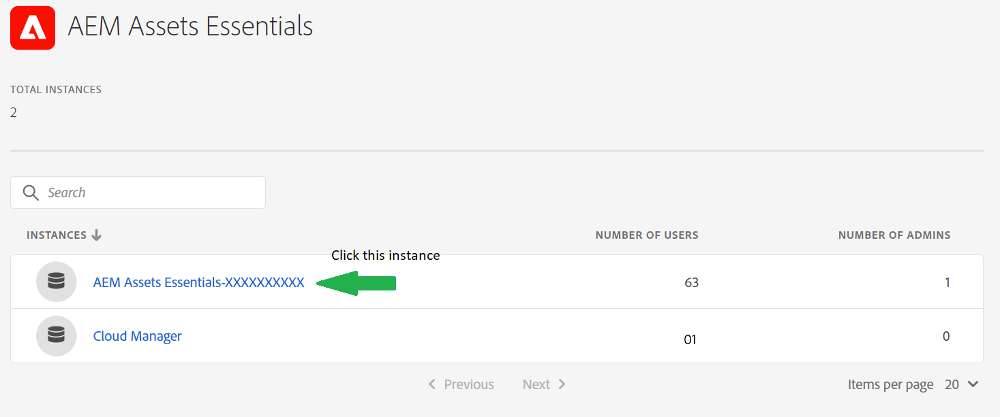

# Experience Manager Assets Essentials beheren {#administer-assets-essentials}

 te schakelen

## Doelstelling

* **Publiek**: De beheerders van Assets Essentials

* **Doelstelling**: Vorm de toegang tot de toepassing van Assets Essentials gebruikend de Admin Console en beheer dan de taken die na het registreren aan de toepassing van Assets Essentials kunnen worden uitgevoerd.

## Overzicht {#overview}

[!DNL Adobe Experience Manager Assets Essentials] wordt geleverd door Adobe voor zijn klanten. Als onderdeel van de provisioning wordt [!DNL Assets Essentials] toegevoegd aan de organisatie van een klant in [!DNL Adobe Admin Console] . Beheerders gebruiken [!DNL Admin Console] om gebruikersrechten voor de [!DNL Assets Essentials] -oplossing te beheren en om toepassingsbeheerders toe te wijzen om machtigingen voor en metagegevensformulieren in te stellen in [!DNL Assets Essentials] .

Het volgende diagram van de gegevensstroom illustreert de opeenvolging van taken die een beheerder moet uitvoeren om Assets Essentials te vormen en te beheren:

## Toegang tot de Admin Console {#access-admin-console}

Nadat de oplossing van Assets Essentials wordt geleverd, ontvangt de beheerder een e-mail van Adobe. Het e-mailbericht bevat een welkomstbericht en een koppeling om aan de slag te gaan. Bovendien begint de Adobe het proces om Assets Essentials automatisch op te stellen. Het implementatieproces duurt een uur.

Van de verbinding in e-mail, toegang en login aan [ Admin Console ](https://adminconsole.adobe.com). Als u beheerdertoegang tot meer dan één organisatierekening hebt, dan selecteer de aangewezen organisatie of schakelaar aan het gebruikend de [ organisatieselecteur ](https://helpx.adobe.com/nl/enterprise/using/admin-console.html). Zodra het automatische implementatieproces is voltooid, is de productkaart voor [!DNL AEM Assets Essentials] zichtbaar in [!DNL Admin Console] .

## Taken voor Admin Consoles beheren {#manage-admin-console-tasks}

Voer de volgende taken in Admin Console uit:

* [Gebruikers toevoegen aan productprofielen](#add-users-to-product-profiles)

* [Gebruikersgroepen toevoegen](#add-user-groups)

* [Gebruikers aan groepen toevoegen](#add-users-to-user-groups)

### Gebruikers toevoegen aan productprofielen {#add-users-to-product-profiles}

Voeg gebruikers aan productprofielen toe zodat zij toegang tot de toepassing van Assets Essentials hebben.

Gebruikers toevoegen aan productprofielen:

1. De toegang [ Admin Console ](https://adminconsole.adobe.com) voor uw organisatie, klikt **[!UICONTROL Products]** in de hoogste bar, klikt **[!UICONTROL AEM Assets Essentials]**, en klikt dan de instantie voor [!DNL Assets Essentials]. De naam van de instantie kan anders zijn dan in de onderstaande schermafbeelding.
   >[!NOTE]
   >
   >[!DNL Cloud Manager] -instantie is alleen bedoeld voor speciaal gebruik door beheerders, zoals het controleren van de servicestatus en het verkrijgen van toegang tot servicelogboeken. U kunt deze instantie niet gebruiken om gebruikers aan het product toe te voegen. Voor meer informatie, zie [ admin gids ](deploy-administer.md#view-service-status-and-access-logs-view-logs).

   

   [!DNL Assets Essentials] heeft drie productprofielen die toegang vertegenwoordigen voor beheerders, gewone gebruikers en gebruikers van consumenten.

   

1. Als u een gebruiker aan het product wilt toevoegen, klikt u op een van de drie Assets Essentials van productprofielen, selecteert u **[!UICONTROL Add User]** , geeft u de gebruikersgegevens op en klikt u op **[!UICONTROL Save]** .

    toe

   Wanneer u een gebruiker toevoegt, ontvangt de gebruiker een e-mailuitnodiging om aan de slag te gaan. U kunt de e-mailuitnodigingen uitschakelen in de instellingen voor het productprofiel in [!DNL Admin Console] .

1. Als u een gebruiker uit een groep wilt verwijderen, klikt u op de groep, selecteert u een bestaande gebruiker en selecteert u **[!UICONTROL Remove User]** .

   >[!NOTE]
   >
   >U moet een gebruiker aan het het productprofiel van de Assets Essentials van de Beheerder in de Admin Console toevoegen, opdat zij administratieve taken in de toepassing van Assets Essentials uitvoeren. Deze taken omvatten [ creeer omslagstructuur ](#create-folder-structure), [ leidt toestemmingen voor omslagen ](#manage-permissions-for-folders), en [ Meta-gegevens van de Opstelling Forms ](#metadata-forms).

### Gebruikersgroepen toevoegen {#add-user-groups}

Maak gebruikersgroepen en wijs uw gebruikers toe aan de gebruikersgroepen. Deze gebruikersgroepen zijn beschikbaar in de toepassing Assets Essentials voor het instellen van machtigingen voor mappen.

U kunt gebruikers aan gebruikersgroepen (1) toevoegen en [ gebruikers aan de Profielen van het Product van Assets Essentials (2) ](#add-admin-users). U kunt gebruikersgroepen echter niet rechtstreeks toevoegen aan productprofielen van Assets Essentials (3).

 toe

Voor informatie over hoe te om gebruikersgroepen te beheren, zie `Create user groups` en `Edit user groups` beschikbaar bij [ gebruikersgroepen beheren ](https://helpx.adobe.com/nl/enterprise/using/user-groups.html).

>[!NOTE]
>
>Als uw Admin Console is ingesteld om een extern systeem te gebruiken voor het beheer van gebruikers/groepen-toewijzingen, zoals Azure- of Google-connectors, het synchronisatieprogramma van de gebruiker of de gebruikersbeheerrusten-API, worden uw groepen en gebruikerstoewijzingen automatisch geconfigureerd. Voor meer informatie, zie [ gebruikers van Adobe Admin Console ](https://helpx.adobe.com/nl/enterprise/using/users.html).

### Gebruikers aan groepen toevoegen {#add-users-to-user-groups}

Nadat u gebruikersgroepen hebt gemaakt, kunt u beginnen met het toevoegen van gebruikers aan gebruikersgroepen.

Voor informatie over hoe te om het toevoegen van gebruikers aan gebruikersgroepen te beheren, zie `Add users to groups` beschikbaar bij [ gebruikersgroepen beheren ](https://helpx.adobe.com/in/enterprise/using/user-groups.html#add-users-to-groups).

## Beheerstaken voor Assets Essentials beheren {#manage-assets-essentials-tasks}

Na het uitvoeren van de taken van de Admin Console, kunt u de volgende beleidstaken in de toepassing van Assets Essentials nu uitvoeren:

* [Mappenstructuur maken](#create-folder-structure)

* [Machtigingen voor mappen beheren](#manage-permissions-for-folders)

* [Metagegevens Forms instellen](#metadata-forms)

>[!NOTE]
>
>Om deze taken te kunnen beheren, vooral het beheren van toestemmingen, moet uw gebruiker toepassingsbeleidsrechten hebben - het moet aan het [ het productprofiel van de Assets Essentials van de Beheerder worden toegevoegd ](#add-users-to-product-profiles).

### Mappenstructuur maken {#create-folder-structure}

U kunt de volgende methoden gebruiken om een mapstructuur te maken in de opslagplaats van Assets Essentials:

* Klik op de optie **[!UICONTROL Create Folder]** op de werkbalk om een lege map te maken.

* Klik **[!UICONTROL Add Assets]** optie beschikbaar in de toolbar [ uploadt een omslagstructuur beschikbaar op uw lokale machine ](add-delete.md).

Creeer een omslagstructuur die goed met de bedrijfsdoelstellingen voor de organisatie werkt. Als u een bestaande mapstructuur uploadt naar de opslagplaats van Assets Essentials, moet u de structuur controleren. Voor meer informatie, zie [ Beste praktijken voor efficiënt toestemmingsbeheer ](permission-management-best-practices.md).

Houd rekening met de volgende punten wanneer u van plan bent een mapstructuur te maken in de opslagplaats van Assets Essentials:

* Toekomstig beheer: De omslagen die door beheerders en de omslagen worden geregeerd die [ voor toestemmingen aan andere gebruikers als eigenaars ](manage-permissions.md##manage-permissions-folders) worden gedelegeerd.

* Schaalbaar: de mapstructuur moet voldoen aan de toekomstige behoeften van uw organisatie en moet eenvoudig schaalbaar zijn.

* Grootte: een map mag niet te veel elementen bevatten. Dit kan tot gebruiksproblemen leiden en kan moeilijk te beheren worden.

* Intuïtief: de mapstructuur moet eenvoudig te doorbladeren zijn en intuïtief voor de eindgebruikers. Gebruikers moeten gemakkelijk kunnen zien waar ze een nieuw element in de mappenstructuur kunnen uploaden.

Er zijn diverse mogelijke typen mapstructuur die u voor uw organisatie kunt gebruiken. Hieronder volgen enkele voorbeelden van gangbare mapstructuren:

### Machtigingen voor mappen beheren {#manage-permissions-for-folders}

Met Assets Essentials kunnen beheerders de toegangsniveaus voor mappen die in de opslagplaats beschikbaar zijn, beheren. Als beheerder, kunt u gebruikersgroepen tot stand brengen en toestemmingen aan die groepen toewijzen om toegangsniveaus te beheren. U kunt de bevoegdheden voor machtigingsbeheer ook delegeren aan gebruikersgroepen op mapniveau.

>[!VIDEO](https://video.tv.adobe.com/v/341104)

Voor meer informatie, zie [ toestemmingen voor omslagen ](manage-permissions.md) leiden.

### Metagegevens Forms instellen {#metadata-forms}

Assets Essentials bieden standaard veel standaardvelden voor metagegevens. Organisaties hebben extra behoeften aan metagegevens en hebben meer metagegevensvelden nodig om bedrijfsspecifieke metagegevens toe te voegen. Met metagegevensformulieren kunnen bedrijven aangepaste metagegevensvelden toevoegen aan de pagina [!UICONTROL Details] van een element. De bedrijfsspecifieke metagegevens verbeteren het beheer en de ontdekking van de bedrijfsmiddelen. U kunt geheel nieuwe formulieren maken of een bestaand formulier opnieuw gebruiken.

U kunt metagegevensformulieren configureren voor verschillende typen elementen (verschillende MIME-typen). Gebruik dezelfde formuliernaam als het MIME-type van het bestand. Essentiële elementen komen automatisch overeen met het MIME-type voor geüploade elementen met de naam van het formulier en werken de metagegevens voor de geüploade elementen bij op basis van de formuliervelden.

Als bijvoorbeeld een metagegevensformulier met de naam `PDF` of `pdf` bestaat, bevatten de geüploade PDF-documenten metagegevensvelden zoals gedefinieerd in het formulier.

Assets Essentials gebruiken de volgende reeks om te zoeken naar bestaande formuliernamen voor metagegevens om de metagegevensvelden toe te passen op de geüploade elementen van een bepaald type:

MIME-subtype > MIME-type > `default` -formulier > Formulier buiten de doos

Als bijvoorbeeld een metagegevensformulier met de naam `PDF` of `pdf` bestaat, bevatten de geüploade PDF-documenten metagegevensvelden zoals gedefinieerd in het formulier. Als een metagegevensformulier met de naam `PDF` of `pdf` niet bestaat, komen de Assets Essentials overeen als er een metagegevensformulier met de naam `application` is. Als er een metagegevensformulier met de naam `application` is, bevatten de geüploade PDF-documenten metagegevensvelden zoals gedefinieerd in het formulier. Als Assets Essentials nog steeds geen overeenkomend metagegevensformulier vinden, wordt gezocht naar het metagegevensformulier `default` om de in het formulier gedefinieerde metagegevensvelden toe te passen op de geüploade PDF-documenten. Als geen van deze stappen werkt, passen de Assets Essentials de meta-gegevensgebieden toe die in uit-van-de-doos vorm op alle geupload documenten van de PDF worden bepaald.

>[!IMPORTANT]
>
>Het nieuwe metagegevensformulier voor een specifiek bestandstype vervangt volledig het standaardmetagegevensformulier dat [!DNL Assets Essentials] biedt. Als u een metagegevensformulier verwijdert of de naam ervan wijzigt, zijn de standaardmetagegevensvelden weer beschikbaar voor nieuwe elementen.

>[!VIDEO](https://video.tv.adobe.com/v/341275)

Voor meer informatie over Meta-gegevens Forms, zie [ Meta-gegevens Forms in Assets Essentials ](metadata.md#metadata-forms).

## Volgende functies

Nu u de toepassing van Assets Essentials hebt gevormd en geleid, [ integreren de toepassingen van het Creative Cloud met de toepassing van de Hoofdzaak van Experience Manager Assets ](integrate-assets-essentials-creative-cloud.md).
