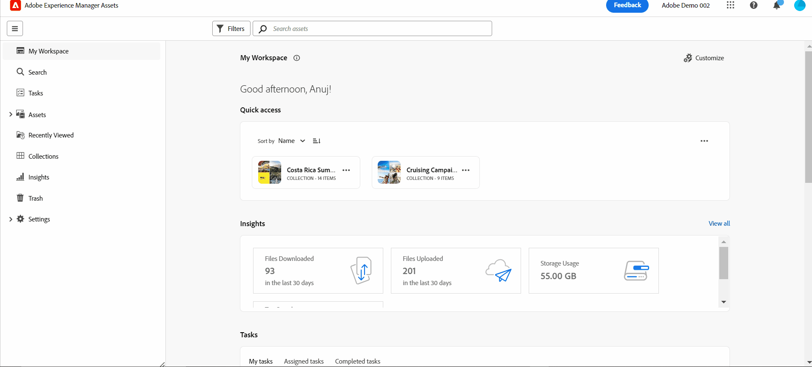

# Inleiding tot middelenweergave {#assets-view}

In het snelle digitale-eerste landschap van vandaag, waar het creëren en leveren van inhoud in real time essentieel zijn, is een Ervaring van het Beheer van Digitale Middelen (DAM) die voor stroomafwaartse marketing snelheid wordt ontworpen van het grootste belang. Adobe, die gebruik maakt van zijn expertise op het gebied van het verbeteren van marketing en creatieve professionals, introduceert een game veranderende nieuwe ervaring voor de gebruiker van de Weergave van Activa. Deze workfloweerste aanpak zorgt voor een revolutie in de manier waarop bedrijven omgaan met hun dynamische digitale middelen, waardoor marketers de mogelijkheid krijgen om efficiënter te zoeken, samen te werken, te personaliseren en middelen te leveren. Deze gestroomlijnde workflows versnellen de snelheid van de inhoud en brengen uw marketinginspanningen naar nieuwe hoogten.

## Hoe te om tot de mening van Activa toegang te hebben? {#access-assets-view}

U kunt de weergave Middelen op de volgende manieren openen:

* **Schakelen in beheerweergave**

   * Aanmelden [!DNL Experience Manager] met Cloud Manager.
   * Ga naar **[!UICONTROL Assets]** > **[!UICONTROL Files]**.
   * Klik op het profielpictogram in de rechterbovenhoek.
   * Klikken **[!UICONTROL Switch View]** van de **[!UICONTROL Profile Settings]** sectie.
Herhaal deze stappen om terug te schakelen naar de beheerweergave.

* **Productschakelaar**
   * Aanmelden [!DNL Experience Manager] en klik op
   * Selecteren **[!UICONTROL Experience Manager Assets]** om de weergave Elementen te openen.
   * Selecteren **[!UICONTROL Experience Manager]** om de beheerweergave te openen.

* **Snelle koppelingen**
   * Meld u aan bij Experience.adobe.com.
   * Klikken **[!UICONTROL Experience Manager Assets]** om de weergave Elementen te openen.
   * Klikken **[!UICONTROL Experience Manager Assets]** om de weergave Elementen te openen.

## Mijn werkruimtemashboard biedt gestroomlijnde ervaringen

Doe een groeten aan een Digital Asset Management-oplossing die de uiteenlopende behoeften van verschillende organisatorische rollen begrijpt. De gestroomlijnde nieuwe middelenweergave geeft voorrang aan gebruiksgemak en snelheid, waarbij de voorkeur van de marketers wordt afgestemd op visuele aantrekkingskracht en werkruimten zonder rommeligheid. Met een aanpasbaar gebruikersspecifiek dashboard voor Mijn werkruimte kunnen marketers snel middelen zoeken, voorvertonen, bewerken, beheren en leveren met opmerkelijke efficiëntie. Bodyvakantie naar eindeloze uren besteed aan het zoeken naar specifieke middelen en verwelkom een gestroomlijnde ervaring die alles wat u nodig hebt binnen handbereik brengt.

