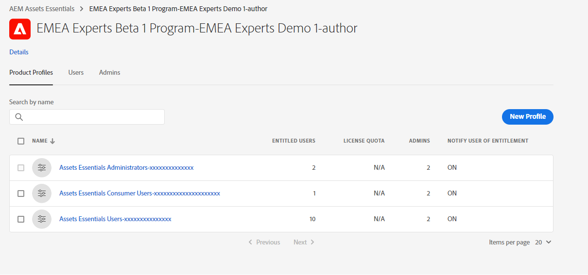
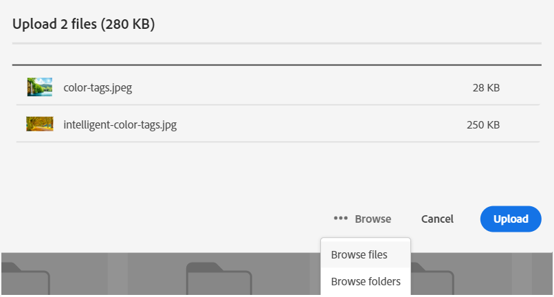

# Beheer [!DNL Assets Essentials] en voeg gebruikers toe {#administer}

[!DNL Adobe Experience Manager Assets Essentials] wordt geleverd door Adobe voor zijn klanten. Als onderdeel van de provisioning wordt [!DNL Assets Essentials] toegevoegd aan de organisatie van een klant in [!DNL Adobe Admin Console] . Beheerders gebruiken [!DNL Admin Console] om gebruikersrechten voor de [!DNL Assets Essentials] -oplossing te beheren en om toepassingsbeheerders toe te wijzen om machtigingen voor en metagegevensformulieren in te stellen in [!DNL Assets Essentials] .

Het volgende diagram van de gegevensstroom illustreert de opeenvolging van taken die een beheerder moet uitvoeren om Assets Essentials te vormen en te beheren:

 op

## Toegang tot de Admin Console {#access-admin-console}

Nadat de oplossing van Assets Essentials wordt geleverd, ontvangt de beheerder een e-mail van Adobe. Het e-mailbericht bevat een welkomstbericht en een koppeling om aan de slag te gaan. Bovendien begint de Adobe het proces om Assets Essentials automatisch op te stellen. Het implementatieproces duurt een uur.

Van de verbinding in e-mail, toegang en login aan [ Admin Console ](https://adminconsole.adobe.com). Als u beheerdertoegang tot meer dan één organisatierekening hebt, dan selecteer de aangewezen organisatie of schakelaar aan het gebruikend de [ organisatieselecteur ](https://helpx.adobe.com/nl/enterprise/using/admin-console.html). Zodra het automatische implementatieproces is voltooid, is de productkaart voor [!DNL AEM Assets Essentials] zichtbaar in [!DNL Admin Console] .

Voer de volgende taken voor gebruikersrechten uit met behulp van Admin Console:

* [Toepassingsbeheerder voor Assets Essentials maken](#create-assets-essentials-administrator)

* [ voeg gebruikersgroepen ](#add-user-groups) toe

* [Gebruikersgroepen toevoegen aan productprofielen](#add-users-to-product-profiles)

### Toepassingsbeheerder voor Assets Essentials maken {#create-assets-essentials-administrator}

Een beheerder van de Admin Console moet het profiel van het de beheerderproduct van Assets Essentials aan een gebruiker en niet aan een gebruikersgroep toevoegen. De beheerder van de Assets Essentials-toepassing kan vervolgens taken beheren, zoals het maken van een mapstructuur, het uploaden van elementen, het instellen van machtigingen, het instellen van metagegevensformulieren en het maken van openbare verzamelingen. Voor informatie over hoe te om een profiel van de de toepassingsbeheerder van Assets Essentials aan een gebruiker toe te wijzen, zie [ productprofielen aan gebruikersgroepen ](#add-product-profiles-to-user-groups) toevoegen.

### Gebruikersgroepen toevoegen {#add-user-groups}

Maak gebruikersgroepen en wijs uw gebruikers toe aan de gebruikersgroepen. Deze gebruikersgroepen zijn beschikbaar in de toepassing Assets Essentials voor het instellen van machtigingen voor mappen.

Voor informatie over hoe te om gebruikersgroepen te beheren, zie `Create user groups` en `Edit user groups` beschikbaar bij [ gebruikersgroepen beheren ](https://helpx.adobe.com/enterprise/using/user-groups.html).

>[!NOTE]
>
>Als uw Admin Console is ingesteld om een extern systeem te gebruiken voor het beheer van gebruikers/groepen-toewijzingen, zoals Azure- of Google-connectors, het synchronisatieprogramma van de gebruiker of de gebruikersbeheerrusten-API, worden uw groepen en gebruikerstoewijzingen automatisch geconfigureerd. Voor meer informatie, zie [ gebruikers van Adobe Admin Console ](https://helpx.adobe.com/enterprise/using/users.html).

Voor informatie over hoe te om het toevoegen van gebruikers aan gebruikersgroepen te beheren, zie `Add users to groups` beschikbaar bij [ gebruikersgroepen beheren ](https://helpx.adobe.com/in/enterprise/using/user-groups.html#add-users-to-groups).

### Productprofielen toevoegen aan gebruikersgroepen {#add-product-profiles-to-user-groups}

Voeg productprofielen toe aan gebruikersgroepen zodat zij toegang tot de toepassing van Assets Essentials hebben.

Productprofielen toevoegen aan gebruikersgroepen:

1. De toegang [ Admin Console ](https://adminconsole.adobe.com) voor uw organisatie, klikt **[!UICONTROL Products]** in de hoogste bar, klikt **[!UICONTROL AEM Assets Essentials]**, en klikt dan de instantie voor [!DNL Assets Essentials]. De naam van de instantie kan anders zijn dan in de onderstaande schermafbeelding.
   >[!NOTE]
   >
   >[!DNL Cloud Manager] -instantie is alleen bedoeld voor speciaal gebruik door beheerders, zoals het controleren van de servicestatus en het verkrijgen van toegang tot servicelogboeken. U kunt deze instantie niet gebruiken om gebruikers aan het product toe te voegen.

   

   [!DNL Assets Essentials] heeft drie productprofielen die toegang vertegenwoordigen voor beheerders, gewone gebruikers en gebruikers van consumenten.

   * **[!DNL Assets Essentials]Beheerders** hebben beheerderstoegang tot de toepassing. Naast alle mogelijkheden voor eindgebruikers kunnen toepassingsbeheerders in deze groep machtigingen beheren voor elke map en groep/gebruiker in de gehele opslagplaats van de toepassing.

   * **[!DNL Assets Essentials]Gebruikers** hebben toegang tot de volledige gebruikersinterface. Deze gebruikers kunnen digitale elementen uploaden, organiseren, labelen en zoeken.

   * **[!DNL Assets Essentials]De Gebruikers van de consument** kunnen vinden, voorproef, en downloadverrichtingen in Assets Essentials uitvoeren. Ze kunnen ook middelen zoeken en selecteren in Adobe Journey Optimizer en middelen zoeken en selecteren voor gebruik in Workfront.
Voor meer informatie, zie [ Integratie met andere oplossingen ](integration.md).

   

1. Als u een gebruikersgroep aan het product wilt toevoegen, klikt u op een van de drie Assets Essentials van productprofielen, selecteert u **[!UICONTROL Add User]** , geeft u de gegevens van de gebruikersgroep op en klikt u op **[!UICONTROL Save]** .

    toe

   Wanneer u een gebruiker toevoegt, ontvangt de gebruiker een e-mailuitnodiging om aan de slag te gaan. U kunt de e-mailuitnodigingen uitschakelen in de instellingen voor het productprofiel in [!DNL Admin Console] .

   >[!NOTE]
   >
   >U moet een gebruiker aan het het productprofiel van de Assets Essentials van de Beheerder in de Admin Console toevoegen, opdat zij administratieve taken in de toepassing van Assets Essentials uitvoeren. Deze taken omvatten [ creeer omslagstructuur ](#create-folder-structure), [ leidt toestemmingen voor omslagen ](#manage-permissions-for-folders), en [ Meta-gegevens van de Opstelling Forms ](#metadata-forms).

## Toepassing Assets Essentials openen {#access-assets-essentials-application}

Na het uitvoeren van gebruikersrechten in Admin Console, kunt u tot de toepassing van Assets Essentials toegang hebben om de volgende taken uit te voeren:

* [Mappenstructuur maken](#create-folder-structure)

* [Elementen uploaden](#upload-assets)

* [Machtigingen voor mappen beheren](#manage-permissions-for-folders)

* [Metagegevens Forms instellen](#metadata-forms)

* [Openbare verzamelingen maken](#create-public-collections)

### Mappenstructuur maken {#create-folder-structure}

U kunt de volgende methoden gebruiken om een mapstructuur te maken in de opslagplaats van Assets Essentials:

* Klik op de optie **[!UICONTROL Create Folder]** op de werkbalk om een lege map te maken.

* Klik **[!UICONTROL Add Assets]** optie beschikbaar in de toolbar [ uploadt een omslagstructuur beschikbaar op uw lokale machine ](add-delete.md).

Creeer een omslagstructuur die goed met de bedrijfsdoelstellingen voor de organisatie werkt. Als u een bestaande mapstructuur uploadt naar de opslagplaats van Assets Essentials, moet u de structuur controleren. Voor meer informatie, zie [ Beste praktijken van de omslagstructuur voor efficiënt toestemmingenbeheer ](permission-management-best-practices.md##folder-structure-assets-essentials).

Er zijn diverse mogelijke typen mapstructuur die u voor uw organisatie kunt gebruiken. Hieronder volgen enkele voorbeelden van gangbare mapstructuren:

>[!NOTE]
>
>Om deze taken te kunnen beheren, vooral het beheren van toestemmingen, moet uw gebruiker toepassingsbeleidsrechten hebben - het moet aan het [ het productprofiel van de Assets Essentials van de Beheerder worden toegevoegd ](#add-users-to-product-profiles).

### Elementen uploaden {#upload-assets}

Als u nieuwe elementen wilt toevoegen om mee te werken, uploadt u een aantal elementen van uw lokale bestandssysteem. U kunt elementen of mappen slepen naar de gebruikersinterface en de aanwijzingen op het scherm volgen of op de werkbalk op de optie **[!UICONTROL Add Assets]** klikken en bestanden toevoegen aan het dialoogvenster voor uploaden. Hoewel [!DNL Assets Essentials] een krachtige zoekfunctie met volledige tekst biedt, kunt u ook mappen gebruiken om uw elementen beter te ordenen. Voor meer informatie, zie [ activa ](add-delete.md) uploaden.

### Machtigingen voor mappen beheren {#manage-permissions-for-folders}

Met Assets Essentials kunnen beheerders de toegangsniveaus voor mappen die in de opslagplaats beschikbaar zijn, beheren. Als beheerder, kunt u gebruikersgroepen tot stand brengen en toestemmingen aan die groepen toewijzen om toegangsniveaus te beheren. U kunt de bevoegdheden voor machtigingsbeheer ook delegeren aan gebruikersgroepen op mapniveau.

>[!VIDEO](https://video.tv.adobe.com/v/341104)

Voor meer informatie, zie [ toestemmingen voor omslagen ](manage-permissions.md) leiden.

### Metagegevens Forms instellen (optioneel) {#metadata-forms}

Assets Essentials bieden standaard veel standaardvelden voor metagegevens. Organisaties hebben extra behoeften aan metagegevens en hebben meer metagegevensvelden nodig om bedrijfsspecifieke metagegevens toe te voegen. Met metagegevensformulieren kunnen bedrijven aangepaste metagegevensvelden toevoegen aan de pagina [!UICONTROL Details] van een element. De bedrijfsspecifieke metagegevens verbeteren het beheer en de ontdekking van de bedrijfsmiddelen. U kunt geheel nieuwe formulieren maken of een bestaand formulier opnieuw gebruiken.

U kunt metagegevensformulieren configureren voor verschillende typen elementen (verschillende MIME-typen). Gebruik dezelfde formuliernaam als het MIME-type van het bestand. Essentiële elementen komen automatisch overeen met het MIME-type voor geüploade elementen met de naam van het formulier en werken de metagegevens voor de geüploade elementen bij op basis van de formuliervelden.

Als bijvoorbeeld een metagegevensformulier met de naam `PDF` of `pdf` bestaat, bevatten de geüploade PDF-documenten metagegevensvelden zoals gedefinieerd in het formulier.

Voor meer informatie, zie [ de vormen van Meta-gegevens ](metadata.md#metadata-forms).

>[!VIDEO](https://video.tv.adobe.com/v/341275)

Voor meer informatie over Meta-gegevens Forms, zie [ Meta-gegevens Forms in Assets Essentials ](metadata.md#metadata-forms).

### Openbare verzamelingen maken (optioneel) {#create-public-collections}

Een verzameling is een set elementen binnen Experience Manager Assets Essentials. Gebruik verzamelingen om elementen tussen gebruikers te delen.

In tegenstelling tot mappen kan een verzameling elementen van verschillende locaties bevatten. U kunt meerdere verzamelingen delen met een gebruiker. Elke verzameling bevat verwijzingen naar elementen. De referentiële integriteit van activa wordt gehandhaafd over inzamelingen. Voor meer informatie, zie [ inzamelingen ](manage-collections.md) leiden.

## Volgende stappen {#next-steps}

<!-- THIS URL IS A 404 ERROR; NO REDIRECT WAS PUT IN PLACE * [Watch a video to deploy Assets Essentials](https://experienceleague.adobe.com/docs/experience-manager-learn/assets-essentials/provisioning.html?lang=en) -->

* Feedback geven op het product met de optie [!UICONTROL Feedback] die beschikbaar is in de gebruikersinterface van Assets Essentials

* Verstrek documentatie terugkoppelt gebruikend [!UICONTROL Edit this page]  of [!UICONTROL Log an issue]  beschikbaar op juiste sidebar

* De Zorg van de Klant van het contact ](https://experienceleague.adobe.com/?support-solution=General#support)[

>[!MORELIKETHIS]
>
>* [[!DNL Admin Console]  hulp ](https://helpx.adobe.com/nl/enterprise/using/admin-console.html)
>* [[!DNL Cloud Manager]  hulp ](https://experienceleague.adobe.com/docs/experience-manager-cloud-manager/using/introduction-to-cloud-manager.html)
>* [ documentatie van Adobe Journey Optimizer ](https://experienceleague.adobe.com/docs/journey-optimizer/using/ajo-home.html)
>* [ de nota&#39;s van de Versie ](release-notes.md)
>* [ worden begonnen te gebruiken  [!DNL Assets Essentials]](get-started.md)
