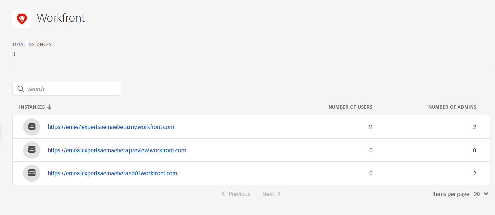

# Assets Essentials integreren met Adobe Workfront {#integrate-assets-essentials-workfront}

[[!DNL Adobe Workfront] ](https://www.workfront.com/) is een werkbeheertoepassing die u helpt de volledige levenscyclus van het werk op één plaats beheren. Dankzij de native integratie tussen [!DNL Adobe Workfront] en [!DNL Assets Essentials] kunnen organisaties de snelheid van inhoud en de tijd die nodig is om op de markt te komen verbeteren door het werk en het middelenbeheer intrinsiek met elkaar te verbinden. In het kader van het beheer van hun werk hebben gebruikers toegang tot de vereiste documenten en afbeeldingen in dezelfde oplossing.

Voer de volgende taken uit om Workfront te integreren met Experience Manager Assets Essentials:

* [Gebruikers toevoegen aan Workfront-productprofielen](#add-users-to-product-profiles)

* [Gebruikers toevoegen aan productprofielen voor Assets Essentials](#add-workfront-users-assets-essentials-product-profiles)

* [Experience Manager Assets Essentials Integration configureren](#configure-assets-essentials-integration)

## Gebruikers toevoegen aan Workfront-productprofielen {#add-users-to-product-profiles}

Gebruikers toevoegen aan Workfront-productprofielen:

1. De toegang [ Admin Console ](https://adminconsole.adobe.com) voor uw organisatie, klikt **[!UICONTROL Products]** in de hoogste bar, klikt **[!UICONTROL Workfront]**, en klikt de eerste instantie in de lijst. Klik niet op de tweede en derde instantie in de lijst.

   

   Admin Console geeft het enige beschikbare productprofiel weer.

1. Als u een gebruiker aan een productprofiel wilt toevoegen, klikt u op het profiel, klikt u op **[!UICONTROL Add User]**, geeft u de gebruikersgegevens op en klikt u op **[!UICONTROL Save]** .

    toe

   Wanneer u een gebruiker toevoegt, ontvangt de gebruiker een e-mailuitnodiging om aan de slag te gaan. U kunt de e-mailuitnodigingen uitschakelen in de instellingen voor het productprofiel in [!DNL Admin Console] .

1. Als u een gebruiker uit een groep wilt verwijderen, klikt u op de groep, selecteert u een bestaande gebruiker en selecteert u **[!UICONTROL Remove User]** .

Voor meer informatie over hoe te om gebruikers en systeembeheerders in Workfront met Adobe Admin Console tot stand te brengen, zie [ gebruikers in Adobe Admin Console ](https://one.workfront.com/s/document-item?bundleId=the-new-workfront-experience&amp;topicId=Content%2FAdministration_and_Setup%2FAdd_users%2FCreate_and_manage_users%2Fadmin-console.htm&amp;_LANG=enus) leiden.

## Gebruikers toevoegen aan productprofielen voor Assets Essentials {#add-workfront-users-assets-essentials-product-profiles}

Wijs de Workfront-gebruikers toe aan een van de volgende productprofielen voor Assets Essentials:

* **[!DNL Assets Essentials]Gebruikers** hebben toegang tot de volledige gebruikersinterface van Assets Essentials. Deze gebruikers kunnen digitale elementen uploaden, organiseren, labelen en zoeken in de toepassing Assets Essentials. Bovendien hebben gebruikers toegang tot de ervaring die met [!DNL Adobe Workfront] -toepassingen is opgedaan bij het selecteren van ingesloten elementen.
* **[!DNL Assets Essentials]Consumentengebruikers**: hebben toegang tot de ingesloten selectie van elementen in de [!DNL Adobe Workfront] -toepassing.

Bovendien is er ook **[!DNL Assets Essentials]Beheerders** productprofiel dat administratieve toegang tot de toepassing verleent.

Voor meer informatie over hoe te om gebruikers aan de profielen van het Assets Essentials product toe te wijzen, zie [ gebruikers aan de profielen van het Assets Essentials product toewijzen ](deploy-administer.md#add-users-to-product-profiles).

## Experience Manager Assets Essentials Integration configureren {#configure-assets-essentials-integration}

Na het toevoegen van gebruikers aan de Workfront en Assets Essentials productprofielen die de Admin Console gebruiken, kunt u [ de integratie van de Hoofdzaak van Experience Manager Assets met Adobe Workfront ](https://one.workfront.com/s/document-item?bundleId=the-new-workfront-experience&amp;topicId=Content%2FDocuments%2FAdobe_Workfront_for_Experience_Manager_Assets_Essentials%2F_workfront-for-aem-asset-essentials.htm) vormen.

Nadat u de integratie hebt ingesteld, kunt u:

* [ de activa en de omslagen van de Verbinding van de Hoofdzaak van Experience Manager Assets ](https://one.workfront.com/s/document-item?bundleId=the-new-workfront-experience&amp;topicId=Content%2FDocuments%2FAdobe_Workfront_for_Experience_Manager_Assets_Essentials%2Flink-to-aem.htm&amp;_LANG=enus)

* [ verzend een Document naar de Hoofdzaak van Experience Manager Assets ](https://one.workfront.com/s/document-item?bundleId=the-new-workfront-experience&amp;topicId=Content%2FDocuments%2FAdobe_Workfront_for_Experience_Manager_Assets_Essentials%2Fsend-to-aem.htm&amp;_LANG=enus)

* [ Bewijs van een verbonden activa voor de Hoofdzaak van Experience Manager Assets ](https://one.workfront.com/s/document-item?bundleId=the-new-workfront-experience&amp;topicId=Content%2FDocuments%2FAdobe_Workfront_for_Experience_Manager_Assets_Essentials%2Fproof-linked-asset-aem.htm)

* [ Mening of download een verbonden activa van de Hoofdzaak van Experience Manager Assets ](https://one.workfront.com/s/document-item?bundleId=the-new-workfront-experience&amp;topicId=Content%2FDocuments%2FAdobe_Workfront_for_Experience_Manager_Assets_Essentials%2Fview-download-asset.htm)
