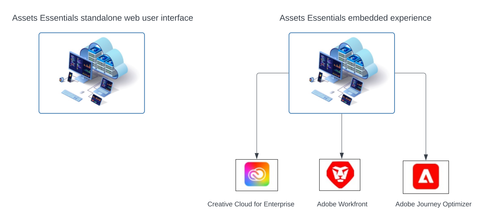

# [!DNL Adobe Experience Manager Assets Essentials]-overzicht {#assets-essentials}

<!-- 
TBD: Update this banner to remove Beta label. 

-->

Adobe biedt robuuste DAM-oplossingen (Digital Asset Management) waarmee u optimaal kunt profiteren van uw digitale middelen. Adobe Experience Manager Assets Essentials is de Adobe-oplossing voor lichtgewicht middelenbeheer voor het opslaan, beheren, ontdekken en gebruiken van digitale middelen.

## Wat is de Hoofdzaak van Activa? {#assets-essemtials-overview}

Experience Manager Assets Essentials is een lichtgewicht editie van Adobe Experience Manager Assets Cloud Service. De Hoofdzaak van activa verstrekt verenigd activabeheer en samenwerking met een vereenvoudigde, moderne gebruikersinterface. Met de gebruiksvriendelijke oplossing kunnen meer creatieve en marketingteams digitale middelen opslaan, ontdekken en distribueren.

Met Elementen kunt u:

* Elementen op een centrale locatie beheren, ordenen en beheren.

* Samenwerken aan de ontwikkeling van inhoud in verschillende teams.

* Toegang tot, zoek naar en zoek naar definitief goedgekeurde middelen.

* U kunt middelen delen en downloaden voor levering achteraf.

## Hoe te om tot de Hoofdzaak van Activa toegang te hebben? {#access-options}

De Hoofdzaak van activa biedt een standalone Webgebruikersinterface voor eind - gebruikers en beheerders aan, die hen toegang tot alle mogelijkheden van de oplossing geven. Gebruikers van andere Adobe-oplossingen kunnen ook toegang krijgen tot en werken met middelen van Assets Essentials via een ingesloten ervaring die in Creative Cloud beschikbaar is voor zakelijke, Adobe Journey Optimizer- en Adobe Workfront-toepassingen.

## Waarom de Hoofdzaak van Activa? {#assets-essentials-features}

De Hoofdzaak van activa verstrekt zeer belangrijke voordelen, die u toestaan om:

* **begin snel** met uit-van-de-doos hulpmiddelen van het activabeheer.

* Breid toegang tot activa tot meer teams uit om verenigbare klantenervaringen met **vereenvoudigd activabeheer** te leveren.

* Verenigen inhoudslevenscyclus met inheemse **integratie in andere oplossingen van Adobe**.

* Hefboomwerking a **op wolk-Gebaseerd platform**, veilig en klaar om op om het even welk ogenblik, overal te schrapen.

* Begin met essentiële mogelijkheden DAM en **kweek** aan onderneming DAM.

**begin snel**

De oplossing Assets Essentials wordt door Adobe aan klanten geleverd en is beschikbaar nadat het inrichtingsproces is voltooid. Beheerders krijgen toegang tot het product in Adobe Admin Console en kunnen de systeemconfiguratie en de instaptoegang van gebruikers direct starten.

Leer meer op het beleid van de Hoofdzaak van Activa [&#x200B; en gebruiker op het instappen &#x200B;](deploy-administer.md).

**Vereenvoudigd activabeheer**

Dankzij de vereenvoudigde gebruikersinterface van Assets Essentials kunt u uw digitale middelen eenvoudig beheren, ontdekken en distribueren. Een brede reeks gebruikers van verschillende functies, met inbegrip van creatieve, marketing en brancheteams kunnen aan activa samenwerken en tot de juiste, goedgekeurde activa toegang hebben wanneer en waar zij hen nodig hebben.

Voor meer informatie, zie [&#x200B; begonnen worden met uw behoeften van het activabeheer gebruikend de Hoofdzaak van Activa &#x200B;](get-started.md).

**Integratie met andere toepassingen van Adobe**

De Hoofdzaak van activa integreert met de gesteunde oplossingen van Adobe en verstrekt een ingebedde ervaring van binnen de interfaces van deze toepassingen. Hiermee kunnen gebruikers eenvoudig toegang krijgen tot elementen die ze rechtstreeks in hun toepassing nodig hebben. Alle gebruikers kunnen met de zelfde, centraal beheerde activa in hun vertrouwde hulpmiddelen en toepassingen werken.

De ervaring met embedded Assets Essentials is beschikbaar voor Creative Cloud for Enterprise-, Adobe Journey Optimizer- en Adobe Workfront-toepassingen.

Voor meer informatie, zie [&#x200B; Integratie met andere oplossingen van Adobe &#x200B;](integration.md).

**op wolk-Gebaseerd platform**

Dankzij de Adobe-cloudinfrastructuur kunnen organisaties zich richten op hun zakelijke behoeften door digitale middelen te maken, beheren en distribueren. Bovendien zorgt Adobe ervoor dat de oplossing beschikbaar, veilig, schaalbaar en altijd up-to-date is, met productinnovaties die naadloos aan gebruikers worden verstrekt via frequente updates.

**groei-met-u mogelijkheden**

Ga snel aan de slag met de Essentiële elementen van bedrijfsmiddelen om te profiteren van de belangrijkste mogelijkheden voor beheer van digitale bedrijfsmiddelen in verschillende teams.

Wanneer uw bedrijfsbehoeften groeien en u steun voor geavanceerde Vereisten van het Beheer van Activa, zoals aanpassingen, rekbaarheid en integratie, automatisering, Dynamische Media, en Brand Portal nodig hebt, biedt Adobe ook [&#x200B; Adobe Experience Manager Assets as a Cloud Service &#x200B;](https://experienceleague.adobe.com/docs/experience-manager-cloud-service/content/assets/home.html?lang=nl-NL) aan.

## Volgende stappen {#next-steps}

* Feedback geven op het product met behulp van de optie [!UICONTROL Feedback] die beschikbaar is in de gebruikersinterface Assets Essentials

* Verstrek documentatie terugkoppelt gebruikend [!UICONTROL Edit this page]  of [!UICONTROL Log an issue]  beschikbaar op juiste sidebar

* De Zorg van de Klant van het contact [&#128279;](https://experienceleague.adobe.com/nl?support-solution=General#support)

>[!MORELIKETHIS]
>
>* [[!DNL Assets Essentials]  leerprogramma&#39;s pagina &#x200B;](https://experienceleague.adobe.com/docs/experience-manager-learn/assets-essentials/overview.html?lang=nl-NL)
