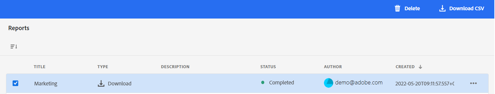

# Rapporten beheren {#manage-reports}

>[!CONTEXTUALHELP]
>id="assets_reports"
>title="Rapporten"
>abstract="Middelenrapportage geeft beheerders inzicht in de activiteiten van de Adobe Experience Manager Assets Essentials-omgeving. Deze gegevens bevatten nuttige informatie over de manier waarop gebruikers met inhoud en het product werken. Alle gebruikers die aan het het productprofiel van Beheerders worden toegewezen kunnen tot het dashboard van Inzichten toegang hebben of user-defined rapporten creëren."

Middelenrapportage geeft beheerders inzicht in de activiteiten van de Adobe Experience Manager Assets Essentials-omgeving. Deze gegevens bevatten nuttige informatie over de manier waarop gebruikers met inhoud en het product werken.

## Toegangsrapporten {#access-reports}

Alle gebruikers die zijn toegewezen aan de [Productprofiel Assets Essentials-beheerders](deploy-administer.md) U kunt het dashboard van Inzichten openen of user-defined rapporten in Assets Essentials tot stand brengen.

## Inzichten weergeven {#view-live-statistics}

Met Assets Essentials kunt u realtime gegevens voor uw Assets Essentials-omgeving weergeven met het dashboard Inzichten. U kunt real-time gebeurtenismetriek tijdens de laatste 30 dagen of voor de laatste 12 maanden bekijken.

Klikken **[!UICONTROL Insights]** U kunt de volgende automatisch gegenereerde grafieken weergeven in het linkernavigatiegebied:

* **Downloads**: Het aantal elementen dat in de laatste 30 dagen of twaalf maanden in de omgeving van de Assets Essentials is gedownload, uitgedrukt aan de hand van een lijndiagram.

* **Uploads**: Het aantal elementen dat in de laatste 30 dagen of twaalf maanden in de omgeving van de Assets Essentials is geüpload, uitgedrukt aan de hand van een lijndiagram.

* **Meest gebruikte zoekopdrachten**: Bekijk de belangrijkste gezochte termen samen met het aantal keren dat deze termen binnen uw Assets Essentials-omgeving zijn doorzocht in de laatste 30 dagen of 12 maanden, weergegeven in een tabelindeling.

<!--

* **Storage usage**: The storage usage, in gigabytes (GB), for the Assets Essentials environment, for the last 30 days or 12 months represented using a bar chart.

-->

## Een downloadrapport maken {#create-download-report}

Een downloadrapport maken:

1. Navigeren naar **[!UICONTROL Settings]** > **[!UICONTROL Reports]** en klik op **[!UICONTROL Create Report]**.

1. In de [!UICONTROL Configuration] tab, specificeer het rapporttype als **[!UICONTROL Download]**.

1. Geef een titel en een optionele beschrijving voor het rapport op.

1. Selecteer het mappad, waarin de elementen staan waarmee het rapport moet worden uitgevoerd. Gebruik hiervoor de optie **[!UICONTROL Select Folder Path]** veld.

1. Selecteer het datuminterval voor het rapport.
   >[!NOTE]
   >
   > Assets Essentials zetten alle lokale tijdzones om in UTC (Coordinated Universal Time).

1. In de [!UICONTROL Columns] selecteert u de kolomnamen die u in het rapport wilt weergeven.

1. Klik op **[!UICONTROL Create]**.

   

De volgende lijst verklaart het gebruik van alle kolommen die u aan het rapport kunt toevoegen:

<table>
    <tbody>
     <tr>
      <th><strong>Kolomnaam</strong></th>
      <th><strong>Beschrijving</strong></th>
     </tr>
     <tr>
      <td>Titel</td>
      <td>De titel van het element.</td>
     </tr>
     <tr>
      <td>Pad</td>
      <td>Het mappad waar het element beschikbaar is in Assets Essentials.</td>
     </tr>
     <tr>
      <td>MIME-type</td>
      <td>Het MIME-type voor het element.</td>
     </tr>
     <tr>
      <td>Grootte</td>
      <td>De grootte van het element in bytes.</td>
     </tr>
     <tr>
      <td>Gedownload door</td>
      <td>De e-mailid van de gebruiker die het element heeft gedownload.</td>
     </tr>
     <tr>
      <td>Downloaddatum</td>
      <td>De datum waarop de handeling voor het downloaden van middelen wordt uitgevoerd.</td>
     </tr>
     <tr>
      <td>Auteur</td>
      <td>De auteur voor het element.</td>
     </tr>
     <tr>
      <td>Aanmaakdatum</td>
      <td>De datum waarop het element naar Assets Essentials wordt geüpload.</td>
     </tr>
     <tr>
      <td>Wijzigingsdatum</td>
      <td>De datum waarop het element voor het laatst is gewijzigd.</td>
     </tr>
     <tr>
      <td>Verlopen</td>
      <td>De vervalstatus van het actief.</td>
     </tr>
     <tr>
      <td>Gedownload op gebruikersnaam</td>
      <td>De naam van de gebruiker die het element heeft gedownload.</td>
     </tr>           
    </tbody>
   </table>

## Een rapport voor uploaden maken {#create-upload-report}

Een rapport voor uploaden maken:

1. Navigeren naar **[!UICONTROL Settings]** > **[!UICONTROL Reports]** en klik op **[!UICONTROL Create Report]**.

1. In de [!UICONTROL Configuration] tab, specificeer het rapporttype als **[!UICONTROL Upload]**.

1. Geef een titel en een optionele beschrijving voor het rapport op.

1. Selecteer het mappad, waarin de elementen staan waarmee het rapport moet worden uitgevoerd. Gebruik hiervoor de optie **[!UICONTROL Select Folder Path]** veld.

1. Selecteer het datuminterval voor het rapport.

1. In de [!UICONTROL Columns] selecteert u de kolomnamen die u in het rapport wilt weergeven.

1. Klik op **[!UICONTROL Create]**.

   

De volgende lijst verklaart het gebruik van alle kolommen die u aan het rapport kunt toevoegen:

<table>
    <tbody>
     <tr>
      <th><strong>Kolomnaam</strong></th>
      <th><strong>Beschrijving</strong></th>
     </tr>
     <tr>
      <td>Titel</td>
      <td>De titel van het element.</td>
     </tr>
     <tr>
      <td>Pad</td>
      <td>Het mappad waar het element beschikbaar is in Assets Essentials.</td>
     </tr>
     <tr>
      <td>MIME-type</td>
      <td>Het MIME-type voor het element.</td>
     </tr>
     <tr>
      <td>Grootte</td>
      <td>De grootte van het element.</td>
     </tr>
     <tr>
      <td>Auteur</td>
      <td>De auteur voor het element.</td>
     </tr>
     <tr>
      <td>Aanmaakdatum</td>
      <td>De datum waarop het element naar Assets Essentials wordt geüpload.</td>
     </tr>
     <tr>
      <td>Wijzigingsdatum</td>
      <td>De datum waarop het element voor het laatst is gewijzigd.</td>
     </tr>
     <tr>
      <td>Verlopen</td>
      <td>De vervalstatus van het actief.</td>
     </tr>              
    </tbody>
   </table>

## Bestaande rapporten weergeven {#view-report-list}

Na [opstellen van het rapport](#create-download-report)kunt u de lijst met bestaande rapporten weergeven en deze downloaden in CSV-indeling of verwijderen.

Als u de lijst met rapporten wilt weergeven, navigeert u naar **[!UICONTROL Settings]** > **[!UICONTROL Reports]**.

Voor elk rapport, kunt u rapporttitel, het type van het rapport, gespecificeerde beschrijving bekijken terwijl het creëren van het rapport, status van het rapport, e-mailidentiteitskaart van de auteur die het rapport creeerde, en de datum van de rapportverwezenlijking.

`Completed ` de status van het rapport geeft aan dat het rapport klaar is om te worden gedownload .

## Een CSV-rapport downloaden {#download-csv-report}

Een rapport in CSV-indeling downloaden:

1. Ga naar **[!UICONTROL Settings]** > **[!UICONTROL Reports]**.

1. Selecteer een rapport en klik op **[!UICONTROL Download CSV]**.

Het geselecteerde rapport wordt gedownload in CSV-indeling. De kolommen die in het CSV-rapport worden weergegeven, zijn afhankelijk van de kolommen die u selecteert terwijl [opstellen van het rapport](#create-download-report).

## Een rapport verwijderen {#delete-report}

Een rapport verwijderen:

1. Ga naar **[!UICONTROL Settings]** > **[!UICONTROL Reports]**.

1. Selecteer een rapport en klik op **[!UICONTROL Delete]**.

1. Klikken **[!UICONTROL Delete]** nogmaals ter bevestiging.
