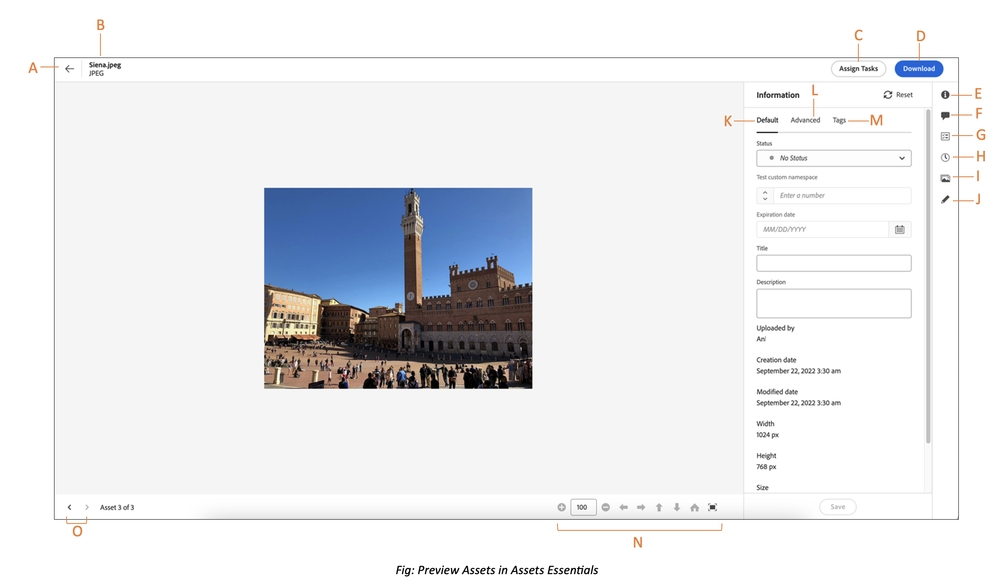

# Naar bestanden en mappen navigeren en elementen weergeven {#view-assets-and-details}

<!-- TBD: Give screenshots of all views with many assets. Zoom out to showcase how the thumbnails/tiles flow on the UI in different views. -->

<!-- TBD: The options in left sidebar may change. Shared with me and Shared by me are missing for now. Update this section as UI is updated. -->

## Begrijp het [!DNL Assets Essentials] gebruikersinterface {#understand-interface-navigation}

[!DNL Assets Essentials] biedt een intuïtieve en gebruikersvriendelijke gebruikersinterface. De schone interface maakt elementen en verwante informatie gemakkelijk te vinden en te herinneren.

Wanneer u zich aanmeldt [!DNL Assets Essentials], ziet u de volgende interface.

![[!DNL Assets Essentials] gebruikersinterface](assets/essentials-interface.png)

    *A: Linkerzijbalk voor bladeren in gegevensopslagruimte en biedt toegang tot een paar andere opties*
    *B: De linkerzijbalk weergeven of samenvouwen om het gebied voor weergave van elementen te vergroten*
    *C: Zoekresultaten filteren*
    *D: Alle inhoud van de geselecteerde map selecteren*
    *E: Opties voor het sorteren van elementen*
    *F: Zoekvak*
    *G: Bestanden uploaden of slepen en neerzetten met `Add Assets` knop*
    *H: Een nieuwe map maken*
    *I: Schakelen tussen verschillende weergaven*

<!-- TBD: Need an embedded video here with narration. It has to be hosted on MPC to be embeddable. -->

## Door elementen en mappen bladeren en deze weergeven {#browse-repository}

U kunt door de mappen bladeren vanuit de hoofdgebruikersinterface of vanuit de linkerzijbalk. Wanneer u bladert, kunt u de interface gebruiken om elementminiaturen weer te geven en visueel door de opslagplaats te bladeren of elementdetails weer te geven om snel het gewenste element te vinden. In de linkerzijbalk zijn de volgende opties beschikbaar:

* [Mijn werkruimte](https://experienceleague.adobe.com/docs/experience-manager-assets-essentials/help/my-workspace.html?lang=en): Middelen bevatten nu een aanpasbare werkruimte die widgets biedt voor eenvoudige toegang tot belangrijke gebieden van de gebruikersinterface van Elementen en informatie die voor u het meest relevant is. Deze pagina dient als een one-stop oplossing om een overzicht van uw het werkpunten te verstrekken en snelle toegang tot zeer belangrijke werkschema&#39;s te geven. Een handiger toegang tot deze opties verhoogt de efficiëntie en snelheid van de inhoud.
* [Taken](https://experienceleague.adobe.com/docs/experience-manager-assets-essentials/help/my-workspace.html?lang=en): U kunt de taken bekijken die onder **Mijn taken** tab. U kunt de taken die u hebt gemaakt onder **Toegewezen taken** tab. Bovendien worden de taken die u voltooit gevestigd onder **Voltooide taken** tab.
* [Activa](https://experienceleague.adobe.com/docs/experience-manager-assets-essentials/help/manage-organize.html?lang=en): Lijst met alle mappen in een boomstructuurweergave waartoe u toegang hebt.
* **Onlangs bekeken**: Lijst met elementen waarvan u onlangs een voorvertoning hebt weergegeven. [!DNL Assets Essentials] geeft alleen de elementen weer die u voorvertoont. De elementen die u voorbij schuift tijdens het bladeren door de bestanden of mappen in de opslagplaats worden niet weergegeven.
* [Verzamelingen](https://experienceleague.adobe.com/docs/experience-manager-assets-essentials/help/manage-collections.html?lang=en): Een verzameling is een set elementen, mappen of andere verzamelingen in Adobe Experience Manager Assets Essentials. Gebruik verzamelingen om elementen tussen gebruikers te delen. In tegenstelling tot mappen kan een verzameling elementen van verschillende locaties bevatten. U kunt meerdere verzamelingen delen met een gebruiker. Elke verzameling bevat verwijzingen naar elementen. De referentiële integriteit van activa wordt gehandhaafd over inzamelingen.

* [Inzichten](https://experienceleague.adobe.com/docs/experience-manager-assets-essentials/help/manage-reports.html?lang=en#view-live-statistics): In [!DNL Assets Essentials]kunt u real-time inzichten op uw dashboard bekijken. Met Assets Essentials kunt u realtime gegevens voor uw Assets Essentials-omgeving weergeven met het dashboard Inzichten. U kunt real-time gebeurtenismetriek tijdens de laatste 30 dagen of voor de laatste 12 maanden bekijken.

* **Prullenbak**: Maak een lijst met de elementen die uit de hoofdmap zijn verwijderd **[!UICONTROL Assets]** map. U kunt een middel in de omslag van het Afval selecteren om of het aan zijn originele plaats te herstellen of het permanent te schrappen. U kunt een trefwoord opgeven of filters toepassen, zoals de status van het element, het bestandstype, het mime-type, de afbeeldingsgrootte, het maken van elementen, wijzigingen en vervaldatums, en het filteren op elementen die door de huidige gebruiker zijn verwijderd. U kunt ook aangepaste filters toepassen om te zoeken naar de juiste middelen in de map met prullenmand. Voor meer informatie over het gebruiken van standaard en douanefilters, zie hoe te [zoekelementen in Assets Essentials](search.md).

* **Instellingen**: U kunt verschillende opties voor Assets Essentials configureren met **Instellingen**, zoals metagegevensformulieren, rapporten en taxonomiebeheer.

<!-- TBD: Not sure if we want to publish these right now. CC Libs are beta as per Greg.
* **Libraries**: Access to [!DNL Adobe Creative Cloud Team] (CCT) Libraries view. This view is visible only if the user is entitled to CCT Libraries.
-->

<!-- TBD: My Work Space shows task inbox and it is not visible on AEM Cloud Demos as of now. It is the source of truth server hence not documenting My Work Space option for now.
-->

U kunt de linkerzijbalk openen of samenvouwen om het beschikbare gebied voor middelenweergave te vergroten.

In [!DNL Assets Essentials]kunt u elementen, mappen en zoekresultaten in vier verschillende typen indelingen weergeven.

*  [!UICONTROL List View]
*  [!UICONTROL Grid View]
*  [!UICONTROL Gallery View]
*  [!UICONTROL Waterfall View]

Als u een element wilt zoeken, kunt u de elementen in oplopende of aflopende volgorde sorteren van `Name`, `Relevancy`, `Size`, `Modified`, en `Created`.

Als u naar een map wilt navigeren, dubbelklikt u op de miniaturen van de map of selecteert u de map in de linkerzijbalk. Als u de details van een map wilt weergeven, selecteert u de map en klikt u op Details op de werkbalk boven in het scherm. Als u omhoog en omlaag wilt navigeren in de hiërarchie, gebruikt u de linkerzijbalk of de broodkruimels bovenaan.

*Afbeelding: als u in de hiërarchie wilt bladeren, gebruikt u de broodkruimels boven of links in de zijbalk.*

## Elementen voorvertonen {#preview-assets}

Voordat u middelen gebruikt, deelt of downloadt, kunt u deze nauwkeuriger bekijken. Met de voorvertoningsfunctie kunt u niet alleen de afbeeldingen bekijken, maar ook een paar andere ondersteunde elementtypen.

Als u een voorvertoning van een element wilt weergeven, selecteert u het en klikt u op [!UICONTROL Details]  van de werkbalk bovenaan. U kunt niet alleen het element weergeven, maar ook de gedetailleerde metagegevens bekijken en andere handelingen uitvoeren.

*A: Ga terug naar de huidige map of het huidige zoekresultaat in de repository*
*B: Naam en indeling voor het bestand waarvan u een voorvertoning weergeeft*
*C: Taken toewijzen*
*D: Middel downloaden*
*E: Voorbeeld van element bekijken en informatie over metagegevens bekijken*
*D: Geavanceerde metagegevens*
*E: Trefwoorden en slimme tags*
*F: Opmerking en annotatie*
*G: Taken weergeven met betrekking tot het geselecteerde element*
*H: Versies weergeven en beheren*
*I: Uitvoeringen van de afbeelding weergeven*
*J: Afbeelding bewerken*
*K: Basismetagegevens*
*L: Geavanceerde metagegevens*
*M: Trefwoorden en slimme tags*
*N: Meer informatie. Zoomen, volledig scherm en andere opties*
*O: Ga naar het vorige of volgende middel in de huidige omslag zonder terug naar de omslag te gaan*

U kunt ook voorvertoningen van video&#39;s weergeven.

Als u expliciet een voorvertoning van een element weergeeft, [!DNL Assets Essentials] geeft deze weer als een onlangs weergegeven element.

<!-- TBD: Describe the options.

Explicitly previewed assets are displayed as recently viewed assets. Give screenshot of this.
Other use cases after previewing.
-->

## Weergave van kolommen configureren voor de weergave Lijst met elementen {#configure-columns-list-view}

U kunt de kolommen selecteren die in de weergave Lijst met elementen worden weergegeven, zoals Status, Indeling, Dimensionen, Grootte, enzovoort:

1. Selecteren **[!UICONTROL Assets]** in het linkernavigatievenster schakelt u over naar de weergave Lijst met elementen en klikt u op .

1. Selecteer de kolommen die u in de lijstweergave wilt weergeven en klik op **[!UICONTROL Confirm]**.

   

## Volgende stappen {#next-steps}

* Feedback geven op het product met de [!UICONTROL Feedback] optie beschikbaar in de gebruikersinterface van Assets Essentials

* Documentfeedback geven met [!UICONTROL Edit this page]  of [!UICONTROL Log an issue]  beschikbaar op de rechterzijbalk

* Contact [Klantenservice](https://experienceleague.adobe.com/?support-solution=General#support)

>[!MORELIKETHIS]
>
>* [Versies van een element weergeven](/help/using/manage-organize.md#view-versions).
