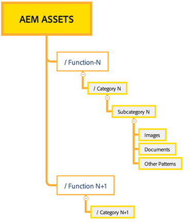

# Tips en trucs voor effectief beheer van machtigingen {#best-practices-permissions-management}

Als beheerder, alvorens u begint de omslagtoestemmingen voor de bewaarplaats van Assets Essentials te beheren, zijn er diverse beste praktijken die u kunt uitvoeren om de infrastructuur voor beheerders en eindgebruikers later intuïtief te maken terwijl het leiden van verrichtingen.

U kunt de volgende aanbevolen procedures opnemen:

* [Gebruikersgroepen maken in Admin Console](#admin-console-best-practices)

* [Mappenstructuur maken in gegevensopslagruimte voor Assets Essentials](#folder-structure-assets-essentials)

* [Machtigingen beheren in gegevensopslagruimte voor Assets Essentials](#folder-permissions)

## Admin Console {#admin-console-best-practices}

Identificeer toegangsbehoeften die op gebruikersgroepen in uw organisatie worden gebaseerd. Plan en maak gebruikersgroepen voor uw organisatie en voeg gebruikers toe aan die gebruikersgroepen. Het is eenvoudiger om mapmachtigingen te beheren op basis van gebruikersgroepen en niet op basis van individuele gebruikers.

## Mapstructuur voor gegevensopslagruimte voor Assets Essentials {#folder-structure-assets-essentials}

Houd rekening met de volgende punten wanneer u van plan bent een mapstructuur te maken in de opslagplaats van Assets Essentials:

* Toekomstig beheer: De omslagen die door beheerders en de omslagen worden geregeerd die [&#x200B; voor toestemmingen aan andere gebruikers als eigenaars &#x200B;](manage-permissions.md##manage-permissions-folders) worden gedelegeerd.

* Schaalbaar: de mapstructuur moet voldoen aan de toekomstige behoeften van uw organisatie en moet eenvoudig schaalbaar zijn.

* Grootte: een map mag niet te veel elementen bevatten. Dit kan tot gebruiksproblemen leiden en kan moeilijk te beheren worden.

* Intuïtief: de mapstructuur moet eenvoudig te doorbladeren zijn en intuïtief voor de eindgebruikers. Gebruikers moeten gemakkelijk kunnen zien waar ze een nieuw element in de mappenstructuur kunnen uploaden.

Er zijn diverse mogelijke typen mapstructuur die u voor uw organisatie kunt gebruiken. Hieronder volgen enkele voorbeelden van gangbare mapstructuren:

* Op functie en categorisering gebaseerd

  

* Gebaseerd op campagne

  

* Gebaseerd op locatie (of kanaal) van aanbieding

  

## Mapmachtigingen {#folder-permissions}

Nadat u gebruikersgroepen voor uw organisatie hebt gemaakt, gebruikers aan die gebruikersgroepen hebt toegevoegd en een mappenstructuur in de opslagplaats voor Assets Essentials hebt geselecteerd en gemaakt die aan de behoeften van uw organisatie voldoet, kunt u beginnen met het beheren van de machtigingen voor uw organisatie. Houd rekening met de volgende punten wanneer u mapmachtigingen gaat beheren:

* Rechten toepassen op gebruikersgroepen, niet op individuele gebruikers. Dit resulteert in een eenvoudigere, efficiëntere machtigingsstructuur.

* Houd de machtigingsstructuur zo eenvoudig mogelijk voor operationele efficiëntie.

* Gebruik toegangsmachtigingen weigeren zorgvuldig en geef de voorkeur aan het toepassen van positieve machtigingen (Kan bewerken, Kan weergeven, Eigenaar) op de mapstructuur.

Voor voorbeelden op hoe te om een efficiënte en eenvoudige omslagstructuur te bereiken, zie [&#x200B; toestemmingen op omslagen &#x200B;](manage-permissions.md##manage-permissions-folders) leiden.

## Volgende stappen {#next-steps}

* Feedback geven op het product met de optie [!UICONTROL Feedback] die beschikbaar is in de gebruikersinterface van Assets Essentials

* Verstrek documentatie terugkoppelt gebruikend [!UICONTROL Edit this page]  of [!UICONTROL Log an issue]  beschikbaar op juiste sidebar

* De Zorg van de Klant van het contact [&#128279;](https://experienceleague.adobe.com/nl?support-solution=General#support)
