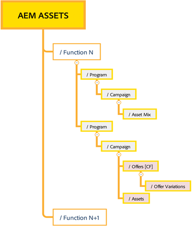

# Tips en trucs voor effectief beheer van machtigingen {#best-practices-permissions-management}

Voordat u de mapmachtigingen voor de Assets Essentials-opslagplaats gaat beheren, kunt u als beheerder verschillende aanbevolen procedures implementeren om de infrastructuur later intuïtief te maken voor beheerders en eindgebruikers tijdens het beheer van bewerkingen.

U kunt de volgende aanbevolen procedures opnemen:

* [Gebruikersgroepen maken in Admin Console](#admin-console-best-practices)

* [Mapstructuur maken in Assets Essentials-opslagplaats](#folder-structure-assets-essentials)

* [Machtigingen beheren in Assets Essentials-opslagplaats](#folder-permissions)

## Admin Console {#admin-console-best-practices}

Identificeer toegangsbehoeften die op gebruikersgroepen in uw organisatie worden gebaseerd. Plan en maak gebruikersgroepen voor uw organisatie en voeg gebruikers toe aan die gebruikersgroepen. Het is eenvoudiger om mapmachtigingen te beheren op basis van gebruikersgroepen en niet op basis van individuele gebruikers.

## Mapstructuur voor Assets Essentials-opslagplaats {#folder-structure-assets-essentials}

Houd rekening met de volgende punten wanneer u van plan bent een mapstructuur te maken in de Assets Essentials-opslagplaats:

* Toekomstig bestuur: De mappen die worden beheerd door beheerders en de mappen die [gedelegeerd aan andere gebruikers als eigenaars](manage-permissions.md##manage-permissions-folders).

* Schaalbaar: De mappenstructuur moet voldoen aan de toekomstige behoeften van uw organisatie en moet eenvoudig schaalbaar zijn.

* Grootte: Een map mag niet te veel elementen bevatten. Dit kan tot gebruiksproblemen leiden en kan moeilijk te beheren worden.

* Intuïtief: De mapstructuur moet eenvoudig te doorbladeren zijn en intuïtief voor de eindgebruikers. Gebruikers moeten gemakkelijk kunnen zien waar ze een nieuw element in de mapstructuur kunnen uploaden.

Er zijn diverse mogelijke typen mapstructuur die u voor uw organisatie kunt gebruiken. Hieronder volgen enkele voorbeelden van gangbare mapstructuren:

* Op functie en categorisering gebaseerd

  

* Gebaseerd op campagne

  

* Gebaseerd op locatie (of kanaal) van aanbieding

  

## Mapmachtigingen {#folder-permissions}

Nadat u gebruikersgroepen voor uw organisatie hebt gemaakt, gebruikers aan die gebruikersgroepen hebt toegevoegd en een mappenstructuur in de Assets Essentials-opslagplaats hebt geselecteerd en gemaakt die aan de behoeften van uw organisatie voldoet, kunt u beginnen met het beheren van mapmachtigingen voor uw organisatie. Houd rekening met de volgende punten wanneer u mapmachtigingen gaat beheren:

* Rechten toepassen op gebruikersgroepen, niet op individuele gebruikers. Dit resulteert in een eenvoudigere, efficiëntere machtigingsstructuur.

* Houd de machtigingsstructuur zo eenvoudig mogelijk voor operationele efficiëntie.

* Gebruik toegangsmachtigingen weigeren zorgvuldig en geef de voorkeur aan het toepassen van positieve machtigingen (Kan bewerken, Kan weergeven, Eigenaar) op de mapstructuur.

Voor voorbeelden over hoe u een efficiënte en eenvoudige mapstructuur kunt bereiken, raadpleegt u [Rechten voor mappen beheren](manage-permissions.md##manage-permissions-folders).

## Volgende stappen {#next-steps}

* Feedback geven op het product met de [!UICONTROL Feedback] -optie beschikbaar in de gebruikersinterface van Assets Essentials

* Documentfeedback geven met [!UICONTROL Edit this page]  of [!UICONTROL Log an issue]  beschikbaar op de rechterzijbalk

* Contact [Klantenservice](https://experienceleague.adobe.com/?support-solution=General#support)
