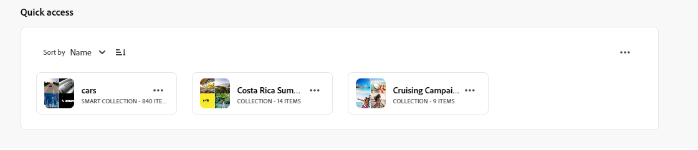
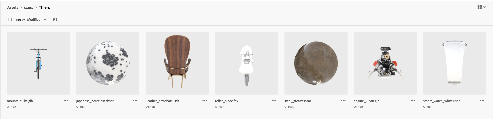
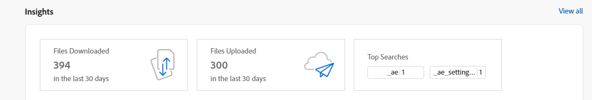

# Opmerkingen bij de release van [!DNL Assets Essentials] {#release-notes}

De huidige release van Assets Essentials wordt gepubliceerd op 30 november 2023.

De nieuwe functies zijn onder andere:

**Ingesloten Adobe Express-editor in AEM Assets**

Gebruikers met toegang tot Express beschikken nu over geïntegreerde gereedschappen voor het bewerken en maken van afbeeldingen op basis van Adobe Express en Adobe Firefly die rechtstreeks in AEM Assets beschikbaar zijn om het hergebruik van inhoud te verbeteren en de snelheid van de inhoud te versnellen.

<!--

**Smart tags blocklist** 

Assets Essentials now enables you to define a list of blocked tags. These tags are automatically removed from the auto-generated smart tags when you upload assets to the repository. This capability performs tags governance and saves a lot of time as you can add a tag to the block list and Assets Essentials automatically excludes it from the list of tags for any of the assets that are added to the repository.

  

-->

**Opslaggebruiksrapporten in Insights**:

Beheerders kunnen nu de rapporten over het opslaggebruik bekijken die beschikbaar zijn als onderdeel van Inzichten.

**Eerste homepage-configuratie zoeken**

Met Assets Essentials kunt u nu de homepage-ervaring voor uw organisatie configureren. Als u eerst zoeken selecteert als startpagina, kunt u de uitlijning van de zoekbalk, de achtergrondafbeelding en het logo voor uw organisatie configureren.

**Verbeteringen gebaseerd op feedback van klanten**

Verbeteringen en foutoplossingen op basis van feedback van klanten.

## Bekende problemen {#known-issues}

De lijst met bekende problemen van [!DNL Assets Essentials] Het aanbod wordt voortdurend herzien en bijgewerkt:

<!--

* Assets Essentials does not support creating Private collections.

-->

* De privé inzamelingen zijn beschikbaar aan schepper en de gebruikers met beheerdervoorrechten. Als beheerder, kunt u niet de toestemmingen delegeren om tot de inzameling aan andere gebruikers toegang te hebben.

* Als beheerder, kunt u niet de toestemmingen delegeren om tot de inzameling aan andere gebruikers toegang te hebben.

Als u problemen of zelfs verbeteringsverzoeken tegenkomt, [feedback geven](#provide-feedback) naar het team.

## Eerdere versies {#past-releases}

### Release oktober 2023 {#october2023-release}

**Bulkimportmiddelen van OneDrive-gegevensbron**

Beheerders kunnen nu [Een groot aantal middelen importeren van OneDrive naar AEM Assets](/help/using/bulk-import-assets-view.md). De bijgewerkte lijst voor de ondersteunde gegevensbronnen voor bulkimport bevat Azure, AWS, Google Cloud, Dropbox en OneDrive.

**Ondersteuning voor interdomeinrechten voor bibliotheken**

Experience Manager Assets stelt u nu in staat om toegang tot Creatives Cloud bibliotheken in een andere IMS-organisatie te configureren. Het maakt gemakkelijker toegang tot de recentste productoverschrijdende werkschema&#39;s tussen Creative Cloud en Experience Manager mogelijk en vermindert tijd en moeite voor creatieve personen.

### Release september 2023 {#september2023-release}

**Metagegevensformulier toewijzen aan een map**

U kunt nu een metagegevensformulier toewijzen aan een specifieke map in de implementatie van Assets Essentials. Alle elementen in de map, inclusief de elementen in de submappen, geven vervolgens de eigenschappen weer die in het toegewezen metagegevensformulier zijn gedefinieerd.

**Bulkimportelementen uit gegevensbronnen**

Beheerders kunnen nu een groot aantal elementen uit een gegevensbron importeren in AEM Assets. De beheerders hoeven geen afzonderlijke elementen of mappen meer te uploaden naar AEM Assets. Tot de ondersteunde gegevensbronnen voor bulkimport behoren Azure, AWS, Google Cloud en Dropbox.

**Gereedschappen voor het bewerken van afbeeldingen aangedreven door Adobe Express**

Eenvoudig en intuïtief gereedschap voor het bewerken van afbeeldingen, aangedreven door Adobe Express die rechtstreeks in AEM Assets beschikbaar is, om het hergebruik van inhoud te verhogen en de snelheid van de inhoud te versnellen.

**Flexibiliteit bij het vastzetten van items voor Mijn werkruimte Snelle toegang**

Mogelijkheid om items voor u, voor uw hele organisatie of voor een lijst met groepen te selecteren en vast te zetten, zodat deze in de sectie Snelle toegang van Mijn werkruimte worden weergegeven op basis van uw selectie.

### Release juli 2023 {#july2023-release}

**Verbeterd kunstmatig intelligentiekader voor beeld Slimme Markeringen**

Experience Manager Assets maakt nu gebruik van een verbeterd kunstmatig intelligentiekader voor slimme tags voor afbeeldingen. Deze inhoudsinfo geeft een betere relevantie en nauwkeurigheid van slimme tags die beschikbaar zijn voor alle afbeeldingselementen bij opname.

**Weergave van kolommen configureren voor de weergave Lijst met elementen**

Met Assets Essentials kunt u nu de kolommen selecteren die worden weergegeven in de weergave Lijst met elementen, zoals Status, Indeling, Dimensionen, Grootte, enzovoort.

**Zoekresultaten sorteren op basis van relevantie**

Assets Essentials sorteren nu standaard de zoekresultaten op Relevantie. U kunt de gezochte middelen in stijgende of dalende orde van sorteren `Name`, `Relevance`, `Size`, `Modified`, en `Created`.

### Release juni 2023 {#june2023-release}

**Hiërarchische codering van elementen voor sneller zoeken**

Vlakke lijsten met gecontroleerde woordenboeken worden in de loop der tijd onbeheersbaar. Assets Essentials ondersteunen nu de hiërarchische coderingsstructuur, die het toepassen van relevante metagegevens, het indelen van elementen, het ondersteunen van zoeken, het hergebruiken van tags, het verbeteren van de ontdekkingsmogelijkheden, enzovoort, vergemakkelijkt.

**Bestanden, mappen en verzamelingen vastzetten voor snelle toegang**

U kunt nu bestanden, mappen en verzamelingen vastzetten zodat u deze items sneller kunt openen wanneer u ze later nodig hebt. De vastgezette items worden weergegeven in het dialoogvenster **Snelle toegang** van Mijn werkruimte. U kunt ze openen met Mijn werkruimte in plaats van naar de locatie te navigeren waar ze zijn opgeslagen in de opslagplaats.

**Elementen filteren in de map Prullenbak**

Met Assets Essentials kunt u nu de middelen filteren die beschikbaar zijn in de map Prullenbak. U kunt standaard- of aangepaste filters toepassen om te zoeken in de juiste middelen in de map met prullenmand om deze te herstellen of permanent te verwijderen.

**Voorvertoningen van miniaturen voor 3D-elementen**

Assets Essentials genereren nu miniatuurvoorvertoningen voor veelgebruikte 3D-bestandsindelingen, zoals gLB, USDz, FBX, 3DS, OBJ en SBSAR. Wanneer deze bestanden naar Assets Essentials worden geüpload, worden automatisch miniaturen gegenereerd door het systeem.

**Bovenste gezochte termen weergeven**

Assets Essentials bieden nu ondersteuning voor het weergeven van de belangrijkste gezochte termen binnen de implementatie van uw Assets Essentials met behulp van de **Inzichten** van Mijn werkruimte. U kunt ook naar gedetailleerde inzichten navigeren om de belangrijkste zoekopdrachten in de afgelopen 30 dagen of 12 maanden weer te geven.

**Verbeteringen in metagegevensformulieren**

Met Assets Essentials kunt u nu tekst met meerdere waarden en vervolgkeuzelijsteigenschappen toevoegen aan de metagegevensformulieren.

### Meerdere releases in 2023 {#multiple-releases-2023}

De lijst met onlangs toegevoegde functies bevat:

**Meest gedownloade elementen**

In Mijn werkruimte worden nu de tien meest gedownloade middelen voor uw Assets Essentials-omgeving weergegeven in de [!UICONTROL Content] sectie. U kunt ook het formaattype en het aantal downloads voor elk vermeld element bekijken.

**Bulkupdates van metagegevens van elementen**

Met updates van bulkmetagegevens kunt u algemene updates van metagegevens tegelijkertijd op meerdere elementen uitvoeren. U hoeft de records niet afzonderlijk bij te werken en kunt snel eigenschappen toepassen op elementen of mappen die via de zoekopdracht worden benaderd.

**Mijn werkruimte met configureerbare widgets**

De middelen verstrekken nu een aangepaste werkruimte voor u, die als één-lokoplossing dient om gemakkelijke toegang tot zeer belangrijke gebieden van het gebruikersinterface van Activa en informatie te verlenen die voor u het meest relevant is. Snellere toegang tot deze opties verhoogt de snelheid en efficiëntie van de inhoud van uw projecten.

Mijn werkruimte bevat widgets voor inzicht, taken en inhoud. U kunt configureren hoe deze widgets in uw werkruimte worden weergegeven op basis van uw voorkeuren.

**Gebruikersinterface voor toegewezen taakbeheer**

Met de Assets Essentials kunt u nu de lijst met taken beheren die u op dat moment hebt toegewezen, die door u zijn gemaakt en die u al hebt voltooid op een gecentraliseerde locatie, met de nieuwe **[!UICONTROL Tasks]** beschikbaar in het linkernavigatiegebied. U kunt ook de juiste handelingen uitvoeren door een taak te selecteren om deze goed te keuren of af te wijzen of door de taakdetails te openen om deze goed te keuren, af te wijzen, te bewerken of te verwijderen.

**Automatisch gegenereerde koppelingen om elementen te delen**

Assets Essentials genereren nu automatisch een koppeling zodra u een element deelt via de gebruikersinterface van Assets Essentials. De gegenereerde koppeling blijft ook geldig als u de vervaldatum wijzigt.

**Verbeteringen gebaseerd op feedback van klanten**

Verbeteringen en foutoplossingen op basis van feedback van klanten.

### 2022.11.0 {#november-2022}

De release van november [!DNL Assets Essentials] wordt vrijgegeven op 17 november 2022.

Deze release biedt:

**Documenten voorvertonen met de Document Cloud Viewer**

Met Assets Essentials kunt u nu documenten in andere ondersteunde indelingen uploaden en deze voorvertonen met de inbegrepen viewer voor Documenten Cloud. Tot de ondersteunde indelingstypen behoren TXT, RTF, DOC, DOCX, PPT, PPTX, XLS en XLSX.

<!--

**View Smart Tags moderation reports**

Asset reporting now provides administrators with visibility into the Smart Tags promoted or deleted for an asset. You can specify a folder path and the report lists the Smart Tags promoted or deleted for all assets available at the folder path.

-->

<!--
**Read-only access to large number of users**

Assets Essentials allows administrators to provide read-only access to a large number of users for selected assets or folders in the repository. 
You can easily synchronize the user groups available on the external identity management of an organization with Adobe Admin Console and then manage permissions in Admin Console and Assets Essentials to provide the users with read-only access for selected assets or folders.

-->

**Nieuwe optie Metagegevens opslaan**

Er is nu een nieuwe optie voor metagegevens opslaan beschikbaar in de gebruikersinterface van Assets Essentials voor een beter beheer van metagegevens.

**Verbeteringen gebaseerd op feedback van klanten**

Verbeteringen en foutoplossingen op basis van feedback van klanten.

**Adobe Asset Link versie 3.3**

[Adobe-itemkoppeling](https://helpx.adobe.com/enterprise/using/adobe-asset-link.html) versie 3.3 wordt uitgebracht op 13 december 2022, met de volgende kenmerken:

* Ondersteuning voor [Creative Cloud voor teams](https://www.adobe.com/creativecloud/business/teams.html) naast [Creative Cloud voor ondernemingen](https://www.adobe.com/creativecloud/business/enterprise.html) voor.

* Ondersteuning voor de nieuwste Adobe InDesign-, Photoshop- en Illustrator 2023-toepassingen.

* Ondersteuning voor het gebruik van de Adobe Asset Link CEP-insteekmodule in omgevingen met proxyservers.

### 2022.8.0 {#august-2022}

In augustus [!DNL Assets Essentials] wordt vrijgegeven op 22 augustus 2022.

Deze release biedt:

**Meldingen voor verzamelingen**

Met meldingen over Assets Essentials kunt u nu de bewerkingen controleren die worden uitgevoerd op de verzamelingen die beschikbaar zijn in de opslagplaats. U moet de verzamelingen waarvoor de meldingen naar u worden verzonden selecteren en er een abonnement op nemen. U kunt ook de bewerkingen configureren waarvoor de meldingen worden verzonden, zoals bewerkingen voor het verwijderen, delen van koppelingen, verplaatsen, hernoemen en bijwerken van verzamelingen.

**Slimme verzamelingen bewerken**

Assets Essentials bieden nu ook de mogelijkheid om de gebruikte zoekcriteria te bewerken tijdens het maken van een slimme verzameling.  Sla de nieuwe zoekcriteria op om de inhoud van de verzameling dynamisch bij te werken.

**Live-statistieken weergeven voor opslagaccount**

Met de Assets Essentials kunt u nu ook realtime opslagaccountgegevens voor uw Assets Essentials-omgeving bekijken met het dashboard Actieve statistieken. U kunt real-time gebeurtenismetriek voor de laatste 30 dagen of voor de laatste 12 maanden bekijken.

**Uploadrapporten weergeven**

Middelenrapportage biedt beheerders nu inzicht in elementen die zijn geüpload naar de Adobe Experience Manager Assets Essentials-implementatie. Beheerders kunnen al rapporten genereren voor de elementen die zijn gedownload van de implementatie van Assets Essentials. Deze gegevens bevatten nuttige informatie over de manier waarop gebruikers met inhoud en het product werken.

**Verbeteringen gebaseerd op feedback van klanten**

Verbeteringen en foutoplossingen op basis van feedback van klanten.

### 2022.6.0 {#june-2022}

De release van juni [!DNL Assets Essentials] wordt vrijgegeven op 14 juli 2022.

Deze release biedt:

**Slimme verzamelingen**

Sla de zoekresultaten op als een slimme verzameling om de inhoud van de verzameling dynamisch bij te werken. Als er aan de gegevensopslagplaats van Assets Essentials activa worden toegevoegd die aan de vastgestelde onderzoekscriteria voldoen [de slimme verzameling maken](manage-collections.md#create-smart-collection), wordt de inhoud van de slimme verzameling automatisch bijgewerkt.

**Meldingen**

Met meldingen voor Assets Essentials kunt u [de bewerkingen controleren die worden uitgevoerd op de middelen of mappen die beschikbaar zijn in de opslagplaats](manage-notifications.md). U moet de inhoud selecteren en zich erop abonneren waarvoor de meldingen naar u worden verzonden. U kunt ook de categorieën configureren waarvoor de meldingen naar u worden verzonden.

**Rapportage**

Met Asset Reporting kunnen beheerders de gebruikersactiviteit binnen Adobe Experience Manager Assets Essentials beoordelen. De rapporten en het levende statistiekdashboard verstrekken nuttige informatie over hoe de gebruikers met activa in uw plaatsing in wisselwerking staan. [De informatie in de rapporten gebruiken](manage-reports.md) om belangrijke succesmetriek af te leiden om de goedkeuring van Activa binnen uw onderneming en door klanten te meten.

U kunt rapporten over het downloaden van middelen en de dashboardmodule voor live statistieken weergeven om te zien welke elementen worden gedownload en hoe vaak het downloaden plaatsvindt.

### 2022.5.0 {#may-2022}

In mei wordt [!DNL Assets Essentials] wordt vrijgegeven op 16 juni 2022.

Deze release biedt:

**Verbeteringen voor status van element**

* Met Assets Essentials kunt u nu [een vervaldatum voor een actief instellen](manage-organize.md#set-asset-status). Bovendien kunt u [filterelementen](search.md#refine-search-results) op basis van de `Expired` de status van de activa en een vervaldatumwaaier.

* U kunt nu de statusindicator van het element weergeven voor alle middelen die beschikbaar zijn in de prullenbak. Hierdoor kunt u een beslissing nemen om een element te herstellen op basis van de status.

**Verbeteringen in zoekfilters**

* Met Assets Essentials kunt u nu [filterelementen](search.md#refine-search-results) met de `No Status` status van het element.

<!--

* Assets Essentials now supports [using a wildcard operator (*) while using custom filters](search.md#custom-filters) to enable Assets Essentials to display assets in the results that partially match the search criteria.

-->

**Verbeteringen voor verzamelingen**

<!--

* Assets Essentials now enables you to [create Private collections](manage-collections.md#create-collection).

-->

* Assets Essentials worden nu ondersteund [een verzameling downloaden](manage-collections.md).

* U kunt nu het metagegevensveld Beschrijving voor een verzameling bewerken.

**Verbeterde documentatie**

* Een nieuwe versie van de [Overzicht van Assets Essentials - documentatie](introduction.md) is nu beschikbaar.

**Verbeteringen gebaseerd op feedback van klanten**

* Verbeteringen en foutoplossingen op basis van feedback van klanten.

### 2022.4.0 {#april-2022}

De huidige release van [!DNL Assets Essentials] wordt vrijgegeven op 12 mei 2022. Deze release biedt:

* [!DNL Assets Essentials] now supports [maken, verzamelingen](manage-collections.md). Een verzameling is een set elementen binnen Experience Manager Assets Essentials. Gebruik verzamelingen om elementen tussen gebruikers te delen. In tegenstelling tot mappen kan een verzameling elementen van verschillende locaties bevatten.

* Met Assets Essentials kunt u nu ook [Aangepaste filters toevoegen](search.md#custom-filters) naar de gebruikersinterface. Vervolgens kunt u deze aangepaste filters naast de standaardfilters toepassen om de zoekresultaten te verfijnen.

* Met Assets Essentials kunt u nu [status instellen](manage-organize.md#set-asset-status) op activa die beschikbaar zijn in de repository. Stel een elementstatus in om het downstreamgebruik van digitale elementen beter te beheren en te beheren.

* Verbeteringen en foutoplossingen op basis van feedback van klanten.

#### Incognitomodus in Chrome {#incognito-mode}

Met deze release optimaliseren we de prestaties van de levering van de gebruikersinterface en zijn specifieke functies in Assets Essentials - opmerkingen maken over elementen en beeldbewerking - afhankelijk van de lokale browseropslag en van cookies van derden. De incognitomodus in de Chrome-webbrowser blokkeert cookies van derden standaard. Gebruikers hebben een aantal opties om toegang te blijven krijgen tot alle mogelijkheden:

* Gebruik Chrome-profielen in plaats van Incognito-modus wanneer de gebruiker browsersessies moet scheiden

* Schakel de `Block third-party cookies` op het scherm Incognito-modus in Chrome

### 2022.2.0 {#march-2022}

[!DNL Assets Essentials] wordt gepubliceerd op 9 maart 2022, met de volgende updates:

* [!DNL Assets Essentials] nu kunt u [een koppeling tot stand brengen en middelen delen met externe belanghebbenden](share-links-for-assets.md), die geen toegang hebben tot [!DNL Assets Essentials] toepassing. U kunt een vervaldatum voor de verbinding bepalen en dan het delen met anderen gebruikend uw aangewezen communicatie methode zoals e-mail of overseinendiensten. Ontvangers van de koppeling kunnen een voorbeeld van de elementen bekijken en deze downloaden.

* De [!DNL Assets Essentials] now includes [een beheerdersproductprofiel](deploy-administer.md#add-users-to-essentials) Admin Console, naast de bestaande normale productprofielen en de profielen van consumentenproducten. Een beheerder kan nu andere gebruikers toewijzen aan het beheerdersproductprofiel.

* Met Assets Essentials kunnen beheerders nu [de toegangsniveaus beheren voor mappen die beschikbaar zijn in de opslagplaats](manage-permissions.md). Als beheerder, kunt u gebruikersgroepen tot stand brengen en toestemmingen aan die groepen toewijzen om toegangsniveaus te beheren. U kunt de bevoegdheden voor machtigingsbeheer ook delegeren aan gebruikersgroepen op mapniveau.

* Verbeteringen en foutoplossingen op basis van feedback van klanten.

Daarnaast [!DNL Adobe Asset Link] een extensie voor Creative Cloud (Photoshop, Illustrator en InDesign) uitgebracht. [nieuwe versie 3.2](https://exchange.adobe.com/creativecloud.details.106875.adobe-asset-link-cep.html)met prestatieverbeteringen in de opstarttijd van het deelvenster en de downloadsnelheid.

### release 2022.1.0 {#january-2022}

[!DNL Assets Essentials] wordt gepubliceerd op 3 februari 2022, met de volgende updates:

* Prestatieverbeteringen voor de [!UICONTROL Create Folder] -bewerking. <!-- CQ-4338818 -->

### release 2021.11.0 {#november-2021}

[!DNL Assets Essentials] wordt gepubliceerd op 16 december 2021, met de volgende updates:

* Adobe implementeert automatisch Assets Essentials nadat het inrichtingsproces is voltooid. De beheerders hoeven geen extra stappen uit te voeren om Assets Essentials op te stellen die [!DNL Cloud Manager] gebruikersinterface. Deze automatische implementatie is beschikbaar voor omgevingen die na 6 januari 2022 zijn ingericht.
* De nieuwe versies van Creative Cloud stoppen die met Assets Essentials werken zijn beschikbaar op de Uitwisseling van de Adobe - [Adobe Asset Link voor Adobe XD v 2.1.0](https://exchange.adobe.com/creativecloud/plugindetails.html/app/cc/61d229b9) en [Adobe Asset Link for Photoshop / InDesign / Illustrator v 3.1.65](https://exchange.adobe.com/creativecloud.details.106875.adobe-asset-link-cep.html).
* Verschillende foutoplossingen en productverbeteringen, inclusief bekende problemen (mappen worden nu correct weergegeven in de linkernavigatiestructuur na het uploaden)<!-- CQ-4337638 -->, uploaden via slepen en neerzetten zorgt ervoor dat de gebruiker de huidige map of een submap kan selecteren bij het neerzetten voor uploaden<!-- CQ-4327753 -->).

### release 2021.8.0 {#august2021}

[!DNL Assets Essentials] 2021.8.0 wordt gepubliceerd op 30 augustus 2021, met de volgende updates:

* Integratie met [!DNL Adobe Workfront] die [!DNL Workfront] gebruikers beheren hun digitale middelen in de context van het beheer van hun werk.

### release 2021.7.0 {#july2021}

[!DNL Assets Essentials] 2021.7.0 wordt gepubliceerd op 29 juli 2021, met de volgende updates:

* U kunt aangepaste metagegevensformulieren maken en beheren die worden gebruikt voor de weergave van eigenschappen van metagegevens voor gebruikers in het scherm met middelendetails [!UICONTROL Metadata Forms] optie onder [!DNL Settings]. Zie [metagegevensformulieren](metadata.md#metadata-forms).
* Verschillende opgeloste problemen en productverbeteringen, waaronder betere prestaties bij het uploaden van een geneste map met veel submappen.

### 2021.6.0-release {#june2021}

De eerste release van [!DNL Assets Essentials], beschikbaar gesteld op 21 juni 2021, biedt lichte mogelijkheden voor middelenbeheer. De volgende belangrijke functies en CRUD-bewerkingen (Maken, Lezen, Bijwerken en Verwijderen) worden ondersteund:

* Upload en voeg elementen toe, waaronder geneste mappen. Geef een voorvertoning weer van de elementen en versies.
* Volledige-tekstonderzoek, genummerde onderzoeksfilters, en bewaarde onderzoeken voor snelle activaontdekking.
* Elementbeheerbewerkingen zoals het bijwerken, verwijderen, downloaden en beheren van metagegevens.
* [!DNL Assets Essentials] is beschikbaar voor [!DNL Adobe Journey Optimizer] gebruikers om de elementen te beheren wanneer ze berichten maken.
